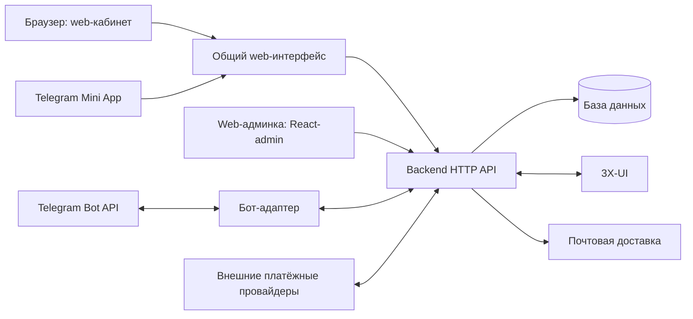

# Самостоятельная VPN-платформа: кабинет, backend и Telegram Mini App

Дата: 2026-10-01. Статус: архитектурный контекст и черновые требования;
продуктовая реализация не начата.

По решению пользователя сначала готовится полный
[роадмап сценариев](../../roadmaps/2026-10-01-platform-roadmap.md),
затем для каждого выбранного сценария — отдельная спецификация и план.
Этот общий документ сохраняет согласованную архитектуру, но не является полной
спецификацией всех функций бота или единым планом их реализации. Каталог API и
детальные настройки ниже уточняются в соответствующих сценариях; сам факт их
описания не означает согласование или реализацию каждого контракта.

[Спецификация С01 «Web-триал»](2026-10-01-s01-web-trial-design.md)
принята пользователем. Она уточняет идентификаторы и фиксирует первый
этап только для новых web-аккаунтов; её граница и API С01 имеют приоритет над
соответствующими предварительными формулировками этого черновика.
[План С01](../plans/2026-10-01-s01-web-trial.md) подготовлен для review;
он конкретизирует файлы, инструменты и порядок реализации только этого сценария.

Исходная версия: `3xui-shop` 1.31.0, commit `74c124906462f5b75a323aa9b80944dd08df2037`.
Исследованы локальные исходники и официальная документация. Production, DNS,
фактически включённые платёжные шлюзы и конфигурация почты не проверялись.

Название продукта не используется в именах модулей, команд, cookie, API и документов. Публичный HTTPS-origin кабинета задаётся настройкой `CABINET_ORIGIN`, а не фиксируется в коде.

## 1. Цель и принятые решения

Пользователь без Telegram самостоятельно регистрируется в
web-кабинете по адресу `CABINET_ORIGIN`, покупает подписку и получает подключение.
Недоступность Telegram не мешает работе кабинета и внешним платежам. В С01
решение по новому триалу зависит от оператора в боте; после фиксации решения
backend выполняет выдачу самостоятельно. Независимое web-решение появляется в Р2.
Telegram Mini App использует тот же аккаунт и backend; бот дополняет кабинет.

Решения пользователя:

- Кабинет — основной интерфейс; регистрация по email и паролю.
- После завершения регистрации покупка доступна без одобрения администратора.
- Пробный доступ для пользователей без Telegram выдаётся по запросу в поддержку.
- Первый сквозной сценарий реализации — регистрация, запрос триала, выдача
  после апрува оператора в боте и подключение клиента без Telegram; решение
  через React-admin отложено до Р2. Апрув касается триала, не регистрации/покупки.
- Backend развёртывается отдельно от бота, интегрируется с 3X-UI и предоставляет
  API кабинету, Mini App и боту.
- Перенос логики поэтапный, окно обслуживания допустимо. Одинаковую операцию
  исполняет только одна сторона; старый обработчик отключается до включения
  нового, бот затем вызывает API backend.
- Общий интерфейс кабинета и Mini App заменяет основную навигацию по меню бота.
- В Mini App доступны Stars и кнопка «Другие способы оплаты», открывающая кабинет
  во внешнем браузере. В браузере доступны включённые внешние способы оплаты.
- Пользователь принимает риск ограничений Telegram из-за такого перехода.
- Первый выпуск: все основные клиентские функции и минимальная web-админка.
- Промокоды и рефералы отложены до последнего функционального этапа роадмапа
  (Р7); они не входят в ранние выпуски и не блокируют кабинет, оплаты и Mini App.
- Web-админка строится на React-admin и работает через API общего backend.
- Согласованный backend-стек: Go + Echo, PostgreSQL + pgx/sqlc, фоновые задания River.
- Внешние платежи: сохранить способы, фактически включённые в текущей системе;
  новые провайдеры в этот объём не добавлять.

Остальные технические решения ниже — предложение для согласования этой
спецификации, а не утверждение о работающей системе.

## 2. Объём первого выпуска

| Возможность | Поведение |
| --- | --- |
| Аккаунт | Регистрация, подтверждение email, вход, выход, восстановление пароля, изменение email и пароля |
| Telegram | Вход Mini App по подписанным данным Telegram; необязательная привязка к web-аккаунту |
| Подписка | Состояние, срок, устройства, лимит и расход трафика, ссылка подключения, QR и инструкции |
| Покупка | Каталог тарифов, первая покупка, продление, смена тарифа, история и состояние платежей |
| Оплата | Stars в Mini App; существующие включённые внешние шлюзы в браузере; ручная оплата, если она включена |
| Автопродление | Просмотр и отключение Stars-рекуррента; сохранение текущих условий его подключения |
| Пробный доступ | Заявка из кабинета; в С01 решение через апрув бота, в Р2 — также React-admin; обычный Telegram-триал сохраняется, реферальная льгота реализуется в Р7 |
| Поддержка | Переписка и вложения в кабинете; ответы оператора в web-админке; Telegram-уведомления необязательны |
| Минимальная админка | Поиск и карточка клиента, подписка и блокировка, выдача триала/дней, тарифы, платежи, поддержка, аудит действий |

В web-админку первого выпуска не входят управление серверами, массовые рассылки,
аналитические отчёты, редактор рекламных кампаний, автоматизация резервных копий
и кнопки перезапуска процесса. Это явное сокращение административного интерфейса.
Серверы и резервные копии обслуживаются по инструкции оператора. Промокоды и
рефералы, включая активацию, редактор и начисления, реализуются в Р7. Их данные,
история и существующие связи сохраняются при проектировании модели и переносе;
полное переключение со старого бота следует после проверки этих функций.
Рекламные кампании остаются отдельным сценарием С25 вместе с отчётами.

Автоматическое объединение двух уже созданных аккаунтов, новые платёжные
провайдеры, PWA, мобильные приложения, несколько backend-реплик и новая система
денежных реферальных выплат не входят в первый выпуск.

## 3. Архитектура и стек

Рекомендация: один репозиторий, один backend с внутренними модулями, общая
frontend-кодовая база для кабинета/Mini App и web-админки, отдельно запускаемый
Telegram-адаптер. Граница проходит между процессами и API;
новые репозитории и микросервисы для платежей или подписок не нужны.



| Компонент | Ответственность и зависимости |
| --- | --- |
| Backend | Аккаунты, сессии, тарифы, заказы, платежи, подписки, поддержка, права, аудит; единственный владелец бизнес-записей и операций панели |
| Frontend | Общие экраны и формы; Telegram SDK подключается только для режима Mini App; никаких секретов или расчёта окончательной цены |
| Web-админка | React-admin: Клиенты, Платежи, Поддержка, Тарифы; общий backend API, без прямого доступа к DB или панели |
| Бот | `/start`, запуск Mini App, `/paysupport`, уведомления, Stars-инвойсы и события оплаты; только backend API и Telegram API |
| Фоновые задачи backend | Выполнение оплаченных заказов, сверка панели, реферальные начисления, сроки подписок, существующие сбросы unlimited-трафика и отправка уведомлений |

Техническое предложение обновлено после обсуждения самостоятельного Go-backend.
Оно заменяет первоначальный вариант выделения Python/aiohttp с сохранением
SQLite. Go + Echo, PostgreSQL + pgx/sqlc, River и React-admin согласованы
пользователем. Остальные детали ниже — проект реализации; согласование стека
само по себе не разрешает изменение продуктового кода или production-перенос.

Backend: Go + Echo для HTTP API, PostgreSQL + pgx/sqlc для запросов и версионируемые
SQL-миграции. Новый backend реализует существующие бизнес-правила; Python-код
служит источником контрактов и проверочных сценариев, но не runtime-зависимостью.
3X-UI вызывается через отдельный Go-модуль с HTTP-клиентом, ограниченными таймаутами
и проверкой ответов. Для криптографии использовать готовые реализации Argon2id
и Ed25519, не писать алгоритмы самостоятельно. Redis сохраняется для ограничений
входа/отправки писем; он не хранит единственный экземпляр платежа или задания.

Фоновые задания Go-backend: предлагаю River поверх PostgreSQL. Его
[транзакционная постановка задания](https://riverqueue.com/docs) позволяет
фиксировать платёж и задание выдачи в одной DB-транзакции. Журнал операции панели
остаётся отдельным: очередь сама по себе не доказывает однократную выдачу.
Команды Telegram-адаптеру сохраняются отдельно с claim/result API; бот не
подключается к DB или очереди River напрямую.

Клиентский frontend: предлагаю React + TypeScript + Vite, обычный CSS и небольшой
слой запросов к API. Общие экраны обслуживают кабинет и Mini App. Web-админка
на React-admin находится по `/admin`; её зависимости загружаются отдельным
chunk только при открытии админки. SSR, Next.js, отдельная Mini App-сборка,
Redux и собственная библиотека компонентов не нужны. Возможность такой сборки
описана в [официальной документации React](https://react.dev/learn/build-a-react-app-from-scratch).

Первый выпуск: один Go-backend-процесс с HTTP API и исполнителями фоновых задач,
отдельная PostgreSQL и постоянное хранилище вложений. Сетевые запросы не держат
SQL-транзакцию открытой. Миграция legacy SQLite в PostgreSQL входит в перенос;
несколько backend-реплик и отдельный процесс исполнителей пока не требуются.

Публичный frontend и `/api/v1` размещаются на одном HTTPS-origin
`CABINET_ORIGIN` из конфигурации. Бот и панель взаимодействуют с backend по закрытой сети;
`/internal/v1` публичный reverse proxy не публикует.

## 4. Владение данными и идентификаторы

Предложение спецификации С01: новый `account_id` — UUID. Числовой `users.id`
старой БД сохраняется как `legacy_user_id`, при импорте создаётся однозначное
соответствие с UUID. Это уточняет первоначальную идею использовать числовой
users.id как общий account_id: независимые БД не должны выдавать пересекающиеся
ID, пока в обеих создаются аккаунты. `tg_id` становится nullable и остаётся
уникальным, когда задан.
Никаких выдуманных Telegram ID для web-пользователей.

У аккаунта независимы четыре значения:

- `account_id`: владелец подписки, платежей и переписки;
- `tg_id`: необязательная внешняя идентичность;
- `vpn_id` и `sub_id`: существующие технические идентификаторы подключения;
- `panel_key`: стабильный технический ключ клиента в поле `email` панели 3X-UI.

В текущем коде `email` панели равен строке Telegram ID. Это **не адрес почты**.
Для мигрированных клиентов `panel_key` сохраняет старое значение. Для новых
клиентов создаётся независимое случайное значение с префиксом `acct_`, которое
проверяется на допустимую длину в используемой версии панели. Изменение email,
привязка Telegram и переход между интерфейсами никогда не меняют `panel_key`,
`vpn_id`, `sub_id` или назначенный сервер.

Для web-регистрации существующие обязательные `vpn_id`/`sub_id` резервируются
при создании аккаунта, а панельный клиент — при выдаче доступа. Если имя не
задано, mandatory `first_name` получает нейтральное «Клиент», не email. Наличие
зарезервированных идентификаторов само по себе не означает активную подписку.

Backend хранит аккаунт, оплаченные права, ожидаемое состояние панели и историю
операций. Панель исполняет VPN-доступ и является источником фактического расхода
трафика и наблюдаемого состояния клиента. При расхождении backend запускает
сверку, а не молча переписывает оплаченный заказ по данным панели. API возвращает
время последней проверки; при сбое показывает устаревшие данные с предупреждением.

### Изменения модели

| Модель | Изменение |
| --- | --- |
| Аккаунты PostgreSQL | UUID account_id, отдельный legacy_user_id для импорта; email, нормализованный уникальный email, `email_verified_at`, хеш пароля, `panel_key`, канал регистрации и роль; nullable уникальный `tg_id` |
| `users` | Использовать независимую блокировку аккаунта и существующий VPN-ban; статус прежней модерации оставить историческим, убрать из допуска к покупке |
| Сессии | Хеш случайного session ID, account_id, способ входа, срок, время последней активности, отзыв; отдельное назначение сессии для операции привязки |
| Одноразовые проверки | Хеш токена, назначение, владелец/целевой email, срок, использование; подтверждение email, восстановление и привязка Telegram |
| Заказы | Владелец, действие, снимок тарифа/цены, канал, состояние исполнения, срок оплаты, idempotency key; ссылка на legacy-транзакцию при миграции |
| Платежи | Владелец и заказ, provider, уникальный provider payment/charge ID, сумма и валюта, статус, признак рекуррента, время получения |
| Операции подписки | Уникальный источник, account_id, ожидаемый результат, фазы выполнения, попытки, ошибка и состояние сверки |
| Задания исполнения/доставки | River хранит задания Go-backend, включая письма и выдачу; отдельные команды Telegram-адаптеру хранят состояние и аренду для уведомлений, Stars-инвойсов/отмен/возвратов |
| Рефералы, начисления, промокоды | Ссылки на account_id вместо обязательного tg_id; исторические значения сохраняются до окончания совместимости |
| Поддержка | Владелец account_id, существующий Telegram thread_id как необязательная связь; новая история сообщений и закрытые вложения |
| Аудит | Явные actor_account_id/target_account_id и канал; исторические actor_id/target_id остаются Telegram ID и не переинтерпретируются |

Таблицы не требуют универсального event bus, отдельной очереди сообщений или
полного event sourcing. Журнал платежей, операции панели и задания доставки
нужны для конкретных восстановлений после сетевого сбоя.

Привязки рефералов и промокодов мигрируются через однозначное соответствие
`legacy users.tg_id → legacy_user_id → account_id UUID`. Неразрешённые ссылки — ошибка предварительной проверки,
а не повод удалить историю. Текущие ограничения повторных начислений сохраняются
на account_id и идентификаторе платежа/операции.

## 5. Регистрация, вход и восстановление

### Новый web-клиент

1. Вводит email; принимает опубликованные условия и политику обработки данных.
   Отображаемое имя необязательно, не заменяет идентичность.
2. Получает письмо с одноразовым подтверждением. До проверки email доступны
   повторная отправка и подтверждение письма, но нельзя покупать или получать триал.
3. Подтверждает email и задаёт пароль. В этой операции атомарно создаётся
   подтверждённый аккаунт. После входа регистрация завершена, покупка доступна
   сразу; административного одобрения нет. VPN-клиент создаётся при выдаче доступа.

Подтверждение адреса — часть регистрации, а не модерация. Письмо использует
одноразовый токен не менее 256 случайных бит, живущий 24 часа. Токен передаётся
через fragment ссылки, забирается frontend, сразу удаляется из адресной строки
и отправляется POST-запросом; автоматическое открытие письма не погашает его.
Запись проверки хранит только хеш токена. Резервный путь — ввод кода из письма.
До подтверждения существует challenge регистрации, не аккаунт с действующим
паролем. Пароль задаётся владельцем почты при завершении: злоумышленник не может
заранее зарегистрировать чужой email со своим паролем и ждать чужого подтверждения.
Повторная регистрация не заменяет пароль уже существующего аккаунта.
Одновременные подтверждения защищаются unique constraint email и потреблением
challenge в одной транзакции; условия/политика сохраняются с версиями и временем.
Ссылки восстановления пароля и смены email используют тот же безопасный способ
передачи токена. После подтверждения регистрации пользователь вводит пароль
для входа; подтверждение письма само не создаёт полноценную сессию.

Email проверяется на сервере; сохраняются введённый адрес и однозначный ключ
сравнения: trim, регистр не учитывается, домен нормализуется. Не удалять точки
или `+suffix` и не придумывать равенство адресов конкретного почтового сервиса.
Вход, восстановление и повторная регистрация не раскрывают существование чужого
адреса. Это выбранная политика продукта; не обещание обнаружить все дубли.

Пароли: 15–128 символов, разрешены пробелы, Unicode, вставка и password manager;
без обязательных комбинаций регистра/цифр, без тихого усечения. Проверять по
локальному списку распространённых паролей. Argon2id, случайная соль; стартовый
минимум 19 MiB памяти, 2 прохода, parallelism 1, затем измерить стоимость на
целевом сервере. Число одновременных хеширований ограничено, чтобы запросы входа
не исчерпывали память и CPU backend. Основания:
[OWASP Authentication](https://cheatsheetseries.owasp.org/cheatsheets/Authentication_Cheat_Sheet.html),
[OWASP Password Storage](https://cheatsheetseries.owasp.org/cheatsheets/Password_Storage_Cheat_Sheet.html).

Восстановление пароля: одинаковый внешний ответ, одноразовый токен на 30 минут,
новый пароль, отзыв всех прежних сессий и уведомление владельца; автоматический
вход после сброса не выполняется. Для С02 пользователь выбрал 2026-10-02 смену
email с текущим паролем и отдельными подтверждениями старого и нового адресов;
до обоих подтверждений старый остаётся действующим. Подробные правила —
в [принятой спецификации С02](2026-10-02-s02-account-security-design.md).
Основание:
[OWASP Forgot Password](https://cheatsheetseries.owasp.org/cheatsheets/Forgot_Password_Cheat_Sheet.html).

### Сессии и ограничения

Opaque session ID хранится в `__Host-session`: Secure, HttpOnly,
SameSite=Lax, Path=/, без Domain. На backend хранится хеш, а не открытый ID.
Сессия клиента: 7 дней без активности, 30 дней абсолютного срока. Сессия
администратора: 30 минут без активности, 8 часов абсолютного срока. При входе,
смене пароля или повышении прав ID заменяется. Изменяющие запросы требуют
CSRF-токен и проверку Origin; идентификаторы сессий не хранить в localStorage.
Основание:
[OWASP Session Management](https://cheatsheetseries.owasp.org/cheatsheets/Session_Management_Cheat_Sheet.html).

Начальные пределы: 5 неуспешных входов на адрес за 15 минут с временной задержкой,
30 попыток на IP за тот же период; отправка писем не чаще раза в минуту и
5 раз в час на адрес. Ограничение по IP не является доказательством общего
владельца и не должно навсегда блокировать общий NAT. Код из письма: 8 цифр,
10 минут, максимум 5 попыток; повторная отправка отзывает предыдущий код.
Эти численные значения — настройки первого выпуска, проверяемые нагрузкой.

Если Redis недоступен, операции входа/отправки писем с потерянным ограничителем
временно недоступны; действующие сессии и обработка платежей продолжают работать
через DB. Отсутствие доставки письма показано пользователю, а не маскируется
сообщением об успешном завершении регистрации.

### Вход Mini App и привязка

Mini App отправляет backend исходный `Telegram.WebApp.initData`. Backend проверяет
Ed25519-подпись официальным публичным ключом Telegram, фиксированный bot_id и
`auth_date` не старше 5 минут, с допуском 60 секунд вперёд на расхождение часов.
Не доверять `initDataUnsafe`, query-параметру `tg_id` или данным о пользователе из
frontend. Bot token остаётся у адаптера. Если интеграция и bot_id не настроены, Telegram
вход недоступен, но это не мешает запуску и web-операциям backend.
Правила построения подписанной строки:
[Telegram: third-party validation](https://core.telegram.org/bots/webapps#validating-data-for-third-party-use).

Успешная проверка находит аккаунт по tg_id либо создаёт Telegram-аккаунт без
email. Такая сессия обозначена как `telegram`; наличие SDK или `?mode=telegram`
само по себе не определяет права и способы оплаты. Browser-сессия получается
только через email/пароль. Если cookie в конкретном Telegram-клиенте не работает,
не выдавать долгоживущий токен в URL: показать открытие браузера и инструкцию.

Существующий Telegram-клиент добавляет email и пароль из действующей Mini App
сессии и подтверждает адрес. Его подписка и платежи остаются в том же account_id.
Для привязки Telegram к web-аккаунту backend создаёт одноразовый случайный challenge
на 10 минут. Его хеш хранится с account_id; пользователь открывает бот по
`/start link_<challenge>`. Адаптер передаёт challenge и настоящий отправительский
tg_id через закрытый API; затем пользователь подтверждает привязку в исходной
web-сессии. Challenge не является разрешением войти или получить подписку.

Если Telegram или email уже принадлежат другому аккаунту, вернуть `LINK_CONFLICT`.
Не объединять подписки автоматически, не сопоставлять по username/имени. После
добавления email или привязки Telegram права и использованный триал не меняются.
Отвязка Telegram разрешена только при подтверждённом независимом входе и после
успешного отключения активного Stars-рекуррента.

Старый клиент без доступа к Telegram и без ранее подтверждённого email не может
автоматически доказать владение аккаунтом. Восстановление идёт через оператора
по согласованной процедуре проверки истории платежей/выдачи. Одна ссылка VPN,
Telegram ID, имя или пересланный скриншот не дают право перепривязать аккаунт.

## 6. Интерфейс и пользовательские потоки

### Общие экраны

- **Главная:** состояние подписки, дата окончания, расход/лимит и актуальность
  данных; кнопки «Подключить», «Продлить», «Выбрать тариф».
- **Тарифы:** устройства, трафик, длительность, окончательная цена и валюта;
  перед сменой тарифа предупреждение о пересчёте периода и сбросе трафика.
- **Оплаты:** история, состояние заказа и доступное действие; отдельное сообщение
  «Оплата получена, подключение готовится», если панель ещё не выполнила заказ.
- **Подключение:** ссылка, копирование, QR, импорт в поддерживаемый VPN-клиент,
  инструкции и fallback, когда браузер не разрешает custom scheme.
- **Профиль:** email, пароль, Telegram, автопродление, выход; приглашения и промокод
  добавляются в Р7.
- **Поддержка:** переписка, заявка на триал и обращение по платежу с номером заказа.

В мобильном интерфейсе нижняя навигация: Главная, Тарифы, Поддержка, Профиль;
оплаты и подключения открываются из соответствующих экранов. На desktop —
боковая навигация. Русский и английский сохраняются из текущего продукта.

Обязательны labels, видимый keyboard focus, управление клавиатурой, читаемые
ошибки у поля, контраст и достаточная зона нажатия. Загрузка и отказ сервиса
не выглядят как пустая подписка. Двойное нажатие не создаёт вторую операцию.

### Переход к другим способам оплаты

1. В Mini App пользователь выбирает тариф и длительность.
2. «Другие способы оплаты» по явному нажатию вызывает `WebApp.openLink()` с
   `new URL('/checkout?plan_id=…&duration_days=…&action=…', CABINET_ORIGIN).toString()`.
   Это не секретные параметры выбора, не готовый платёж и не авторизация.
3. Во внешнем браузере пользователь входит по email/паролю. Если адрес ещё не
   привязан, Mini App сначала предлагает добавить его и подтвердить.
4. Backend повторно проверяет тариф, цену, права и автопродление для аккаунта
   браузерной сессии; затем создаёт **новый** заказ. Браузер показывает, под каким
   аккаунтом выполняется покупка. Cookie WebView и браузера не считаются общими.
5. Пользователь выбирает включённый внешний способ, платит и видит результат.
   При возвращении в Mini App состояние загружается заново из backend.

В URL не попадают initData, сессия, пароль, VPN-ссылка или токен перехода между
аккаунтами. Ссылки выбора не позволяют оплатить заказ другого владельца. В этом
выпуске нет бесшовного входа во внешний браузер по секрету из Mini App.

`openLink` действительно открывает внешнюю ссылку и должен вызываться действием
пользователя: [Telegram Mini Apps](https://core.telegram.org/bots/webapps#initializing-mini-apps).
Однако пункт 6.2 требует Stars для цифровых услуг; изученные условия не дают
явного разрешения на описанную схему перехода. Возможность ограничений —
обоснованный риск, а не утверждение о неизбежной блокировке или разрешённом
исключении. Риск принят пользователем 2026-10-01:
[Telegram Bot Developer Terms, 6.2](https://telegram.org/tos/bot-developers#6-2-digital-goods-and-services).

### Триал и поддержка

Для аккаунтов, первоначально зарегистрированных в web, кнопка «Запросить триал»
создаёт заявку в backend. В С01 оператор получает карточку через существующий
механизм апрува бота и принимает решение кнопками approve/reject; бот передаёт
решение по защищённому API, backend проверяет права реального оператора, сохраняет
результат и исполняет выдачу. Карточка связана с request_id/account_id; Telegram ID
клиента не требуется. Точный контракт адаптера определяется в спецификации С01.
Текущий ApprovalService меняет допуск к регистрации и при reject отменяет Stars;
эти эффекты к решению о триале не применяются. Срок, трафик и устройства берутся
из текущей конфигурации. Покупка не зависит от решения по триалу. Повторная выдача
по тому же запросу не создаёт второе подключение. При недоступности бота заявка
сохраняется и ждёт оператора; регистрация/кабинет продолжают работать. Решение
из карточки клиента React-admin добавляется в Р2 через то же правило backend.

Для существующих и новых Telegram-аккаунтов сохраняются существующие условия
обычного триала; реферальная льгота реализуется вместе с С24 в Р7.
Политика фиксируется по первоначальному каналу,
а не наличию привязанного Telegram: привязка не открывает web-клиенту обход
ручной выдачи. Использование триала и реферальной льготы учитывается на аккаунте.

Переписка новых обращений хранится в backend. В первом выпуске: текст и закрытые
вложения изображений, PDF и текстовых файлов до 10 MiB; проверка реального типа,
случайные имена и выдача только владельцу/оператору. Новая запись аудио/видео в
кабинете отложена. Существующий Telegram-канал сохраняет приём своих типов медиа;
такие сообщения имеют отметку о доступности оригинала в Telegram, если формат
нельзя безопасно отобразить в web. Клиенту для запроса триала и платёжной поддержки
Telegram не требуется; операторское решение по триалу в С01 принимается в боте.

Старые Telegram topics сохраняются; полной web-истории старых сообщений в DB
сейчас нет, поэтому её импорт не обещается. Новые ответы из web доставляются в
кабинет и, если разрешено, уведомлением в Telegram/почту. Сбой уведомления не
отменяет сохранение сообщения.

## 7. Заказ, платёж и выдача доступа

Это три разных сущности. Состояние «платёж получен» нельзя использовать как
доказательство успешного изменения панели. Текущий `_gateway.py` завершает
транзакцию до выдачи доступа и обращается к Telegram; этот порядок заменяется.

### Цена и создание заказа

Клиент передаёт только `plan_id`, `duration_days`, `action` и `payment_method`.
Backend проверяет доступность тарифа, права и состояние подписки, рассчитывает
цену из DB и сохраняет неизменяемый снимок: устройства, длительность, лимит,
группы, сумму и валюту. Цена, Telegram ID и срок VPN из frontend не принимаются.
Деньги — целое число минимальных единиц валюты, Stars — целое число XTR;
расчёт в целых единицах или с точной десятичной арифметикой, не float.
Нельзя пересчитывать уже оплаченный заказ по
изменившемуся тарифу.

`purchase`: первичная выдача; `renew`: продление; `change`: смена с новым периодом
и сбросом расхода по действующим правилам. Backend определяет допустимость
действия, а не доверяет клиентскому `is_extend`. Существующие правила назначения
серверов, regular/euru, hidden unlimited, лимитов и сохранения ban переиспользуются.

Если активен Stars-рекуррент, новая внешняя покупка и смена тарифа требуют сначала
подтверждённого отключения автопродления. Одного нажатия «Отключить» недостаточно:
backend должен получить успешный результат Telegram. Это защита от двойного
списания, а не запрет входить в кабинет.

Неоплаченный заказ доступен для checkout 30 минут. Срок платёжной ссылки зависит
от провайдера и сохраняется отдельно. Платёж, достоверно пришедший после локального
срока заказа, не теряется: сохраняется и проходит выдачу либо разбор конфликтов.
Для ручного перевода — одна открытая заявка на аккаунт, без автоматического
истечения, пока оператор не отменил её. Другой тариф требует отмены старой заявки.

### Состояния и обработка

- Платёж: `pending`, `paid`, `canceled`, `refunded`; подтверждение содержит
  provider ID, сумму, валюту, владельца и источник.
- Исполнение заказа: `not_started`, `queued`, `running`, `applied`, `needs_review`.
- Состояние для клиента: ожидает оплаты/подтверждения, оплачен и выполняется,
  выполнен, отменён, требует помощи, возвращён. Возврат не стирает историю выдачи.

1. Checkout создаёт/находит платёж у провайдера с ключом идемпотентности,
   если шлюз поддерживает его. При неопределённом ответе выполняется поиск по
   ссылке на заказ; новый независимый платёж вслепую не создаётся.
2. Webhook проверяется по правилам конкретного провайдера; если необходимо,
   backend дополнительно читает достоверный статус через API провайдера.
   Возврат браузера и скриншот не подтверждают оплату.
3. В одной DB-транзакции фиксируются событие платежа и постановка заказа на
   выдачу. Повтор `(provider, provider_payment_id)` не создаёт новый заказ/доступ.
4. Backend сериализует изменения одной подписки и исполняет устойчивую операцию
   панели. Состояние `applied` появляется после проверки результата.
5. Уведомления отправляются независимо, через задания доставки. С Р7 начисления
   рефералам ставятся после успешной выдачи, один раз на платёж.

Повтор webhook после перезапуска, ошибке письма или блокировке бота безопасен.
Подтверждённый реальный второй charge сохраняется отдельно; его нельзя скрыть
как дубликат HTTP-запроса. Конфликтующие покупки не создают два VPN-клиента:
backend либо последовательно применяет совместимые операции, либо отдаёт
конфликт на разбор без потери платежа.

### Идемпотентное изменение 3X-UI

Для операции сохраняются исходное состояние, рассчитанная абсолютная дата
окончания, целевой тариф/лимиты/группы, постоянные идентификаторы и фазы исполнения.
Дата продления рассчитывается один раз, при начале сериализованной операции
после завершения предыдущих изменений: по существующим правилам от действующего
срока либо от момента операции при истёкшей подписке. При повторе нельзя вновь
прибавить дни к уже изменённому сроку.

Перед созданием клиента проверяется его наличие по сохранённому panel_key и
существующей логике reconcile. Таймаут после ответа панели требует чтения и
сверки; он не доказывает, что создание не произошло. Частично выполненная
операция не удаляет аккаунт и не выдаёт второй триал.

Особый случай — сброс трафика: текущий renew/change его выполняет. Сброс не
повторять после неопределённого исхода, если это может стереть новый расход.
Такой шаг переводится в `needs_review`, когда факт выполнения нельзя доказать.
После сброса повторно применяется ban, если панель включила клиента.
Пустой набор инбаундов — ошибка; неизвестные группы панели не изменяются.

Одновременно выполняется максимум одна операция на account_id. Для одного
backend достаточно внутрипроцессной блокировки плюс DB-журнала с уникальным
источником, атомарным claim и арендами заданий. После перезапуска незавершённая
операция сначала сверяется. SQL-транзакция не держится во время вызова 3X-UI.

Повторяемые временные ошибки: до 5 попыток с задержками 5, 15, 60, 300, 900 секунд.
Неопределённые необратимые шаги не попадают в слепой повтор; после исчерпания
попыток оператор видит `needs_review`, платёж остаётся `paid`. Кнопка оператора
«Повторить выдачу» продолжает ту же операцию, не создаёт новую.

### Ручная оплата, отмена и возврат

Кнопка «Я оплатил» только отправляет заявку. Оператор проверяет поступление и
подтверждает либо отклоняет; конкурентные решения выполняются атомарно.
Подтверждение ручного платежа сохраняется с оператором и причиной. Это отдельное
подтверждение денег, не возвращение модерации регистрации.

Возврат возможен только оператором после проверки. Stars возвращаются через
бот-адаптер; для внешнего шлюза используется поддерживаемый механизм провайдера,
а при его отсутствии — документированная ручная процедура с записью результата.
Состояние `refunded` ставится по подтверждённому возврату, не по нажатию кнопки.
Не откатывать срок подписки или реферальные дни арифметически без сверки:
последующие продления могли уже изменить состояние. Такая ситуация требует
отдельного решения оператора и аудита; автоматическая политика частичных возвратов
в первый выпуск не входит.

## 8. Telegram-адаптер и Stars

Бот не импортирует ORM, VPNService, платёжные SDK внешних провайдеров и код
фоновых бизнес-задач. Его конфигурация: Telegram token, bot_id, адрес/секрет
закрытого API и настройки webhook. Backend не требует bot token для запуска.

Исходящие действия Telegram хранятся как задания в backend. Адаптер забирает
небольшую пачку через API с ограниченной арендой и возвращает результат. Для
инвойса backend формирует сумму, описание, payload и режим рекуррента; бот
вызывает `createInvoiceLink` и возвращает URL. Frontend получает его через
состояние checkout, открывает Stars-инвойс и затем перечитывает заказ.

Повторная генерация ссылки при потерянном ответе использует тот же order payload.
Перед оплатой backend атомарно проверяет принадлежность заказа настоящему
Telegram-плательщику, сумму, XTR, срок и отсутствие уже принятой первичной оплаты.
Гонка двух инвойсов не должна дважды выдать подписку. Если платформа всё же
доставила два реальных списания, оба фиксируются, второе идёт на возврат/разбор.

Для входящих платежных событий адаптер использует Telegram webhook и проверяет
секретный заголовок. `successful_payment` подтверждается HTTP 2xx только после
устойчивого сохранения события backend; обработка webhook не запускается в фоне
с преждевременным 2xx. Повторы дедуплицируются по Telegram charge ID.
На `pre_checkout_query` нужно ответить в пределах 10 секунд; backend-проверка
получает бюджет 3 секунды. Если она недоступна, бот отклоняет оплату с объяснением,
а не принимает деньги без проверенного заказа.

Telegram повторяет неуспешные webhook ограниченное число раз. Поэтому ошибки
доставки, последний полученный update и очередь требуют наблюдения; бесконечная
гарантия доставки платформой не предполагается. Основание:
[Telegram Bot API: setWebhook и answerPreCheckoutQuery](https://core.telegram.org/bots/api).

Сохраняются текущие правила: автопродление Stars предлагается на первой покупке
30 дней, период 2592000 секунд, не подключается автоматически на иных длительностях
или смене тарифа. Первый charge ID и связь с аккаунтом сохраняются. Каждое
повторное списание создаёт самостоятельную запись платежа и идемпотентное
продление; исходный payload не приводит к повторной первичной выдаче.

Фронтенд `invoiceClosed` не является подтверждением оплаты. Отключение рекуррента
и возврат проходят задания адаптера с результатом в backend. Рекуррент, пришедший
одновременно с отменой, фиксируется и сверяется независимо от UI-флага.

Бот сохраняет `/start`, `/paysupport` и кнопку Mini App; настройка кнопки меню
выполняется адаптером. Права писать пользователю запрашиваются отдельно, отказ
не мешает покупке. Требования Stars и поддержки:
[Telegram Payments Stars](https://core.telegram.org/bots/payments-stars).

## 9. Минимальная web-админка

Принят React-admin. Админка работает по `/admin` на том же HTTPS-origin и
использует административные endpoints `/api/v1/admin`. Реализация состоит из
ресурсов/экранов React-admin и двух адаптеров к общему API: `dataProvider` для
данных и `authProvider` для входа/проверки сессии. Это интерфейс к бизнес-операциям,
а не универсальный редактор таблиц DB. Основания:
[Data Provider](https://marmelab.com/react-admin/DataProviders.html),
[Auth Provider](https://marmelab.com/react-admin/AuthProviderWriting.html).

Четыре раздела: Клиенты, Платежи, Поддержка, Тарифы. Аудит доступен в карточках.

- Карточка клиента: аккаунт и привязки, подписка, panel/server IDs, состояние
  сверки, история платежей и действий. Поиск по account_id, email, tg_id.
- Действия: выдать однократный триал, добавить дни, заменить тариф, сбросить
  трафик, выбрать regular/euru, выдать/снять unlimited, заблокировать/разблокировать.
  Изменения используют общую очередь операций панели и требуют причины.
- Платежи: ручное подтверждение/отказ, paid-but-not-applied, сверка/повтор той же
  операции, инициирование доступного возврата и фиксация внешнего ручного возврата.
- Поддержка: очередь, переписка, ответ, выдача триала из обращения, закрытие.
- Тарифы: существующие устройства, длительности, лимиты, цены и видимость.
  Изменение не влияет на сохранённые снимки заказов. Hidden unlimited не появляется
  в клиентском каталоге из-за ошибки frontend.

`dataProvider` сопоставляет ресурсы `accounts`, `payments`, `support`, `plans`
с явными endpoint-контрактами. Идентификатор записи React-admin `id` отображается
на account/payment/ticket/plan ID без изменения серверных идентификаторов.
Списки возвращают `items` и `total`; адаптер преобразует их в `{data, total}`.
Поиск, фильтры и сортировка выполняются backend по разрешённым полям.
Карточки читаются отдельными GET; создание/редактирование предусмотрено для
тарифов. Универсальные update/delete для аккаунта, платежа и подписки не открывать.
Интерфейс адаптера описан в
[Data Provider Writing](https://marmelab.com/react-admin/DataProviderWriting.html).

Выдача триала, подтверждение оплаты, возврат и изменение подписки — отдельные
кнопки/формы, вызывающие типизированные операции backend. Причина, step-up,
Idempotency-Key и ответ 202 обрабатываются явно; интерфейс показывает выполнение
и перечитывает результат операции. После 202 нельзя сразу показать «Доступ выдан».
Для этих действий не использовать optimistic/undoable обновление: сетевой сбой
не означает отмену уже отправленного действия. Повтор использует тот же ключ.

`authProvider` использует вход/выход и проверку текущего аккаунта общего backend.
HTTP-запросы передают HttpOnly cookie; изменения — CSRF-токен. Session ID не
копируется в JavaScript/localStorage. При 401 требуется новый вход; обычная
client-сессия не допускается в админку. `STEP_UP_REQUIRED` открывает проверку
кодом без автоматического обхода или выполнения действия. При выходе/смене
аккаунта очищаются данные предыдущего пользователя из кеша интерфейса.

Действующие боты поддержки переходят на API вместе с основным ботом:
у них также нет доступа к DB и панели. Старые topics остаются внешними связями,
а новые сообщения дедуплицируются по bot_id и update/message ID.

Первый выпуск использует роли `client` и `admin`; новых ролей без потребности нет.
Первый администратор назначается локальной операторской командой по account_id;
при миграции существующие admin/developer Telegram IDs сопоставляются аккаунтам.
Публичная регистрация никогда не назначает admin. Backend проверяет роль на
каждом запросе; скрытая кнопка не является контролем доступа.

Администратор входит по подтверждённому email и паролю; для изменений нужна
дополнительная проверка одноразовым кодом на его email, действующая 10 минут.
При недоступной почте остаётся чтение, но изменяющие действия не обходят проверку.
Выдача прав и восстановление администраторов — операторская процедура,
не функция публичной формы. Telegram-сессия сама по себе не даёт web-admin доступ.

Блокировка аккаунта и VPN-ban различаются: можно запретить новые покупки/доступ
к чувствительным действиям, сохранив вход для поддержки и истории. Применение
блокировки не уничтожает записи и не молча отменяет уже полученный платёж;
такой заказ рассматривается оператором.

## 10. Предлагаемый HTTP API v1

API-контракта и генератора в исходной версии нет. Ниже — проект контрактов,
а не описание существующих endpoints. Перед реализацией соответствующего среза
создаётся репозиторный OpenAPI 3.1 `docs/api/openapi.yaml` с указанными operationId,
типами, ошибками и security. Frontend и бот реализуются по этому источнику.
В этом документе нет сгенерированных клиентов или ручной копии OpenAPI.

### Общие правила

- Публичный JSON API: `/api/v1`, same-origin, UTF-8; время ISO 8601 UTC.
  К путям клиентской и административной таблиц добавляется этот префикс.
  Полные пути `/internal/v1`, `/webhooks` и `/health` используются без префикса.
- account_id — UUID по предложению С01; plan_id — положительный integer;
  order/payment/operation IDs — UUID;
  tg_id — положительный int64, только в проверенных Telegram/internal данных.
- Cookie-сессия и CSRF для изменений; в закрытом API — отдельная сервисная
  аутентификация с правами адаптера. Сервисный секрет не даёт web-admin права.
  Анонимные auth POST проверяют Origin и допустимый Content-Type, не требуют
  несуществующей сессии. Если действие использует действующую cookie, нужен CSRF.
  Webhook проверяется своей подписью/секретом, не browser Origin или CSRF.
- Проверка владельца выполняется backend для каждого ресурса. Чужой order/ticket
  возвращает 404; отсутствие входа — 401, запрет роли/канала — 403.
- Невалидная структура/поля — 400; конфликт состояния — 409; превышение лимита —
  429 с Retry-After; временно недоступный сервис — 503. Асинхронная операция — 202.
- Ошибка: `{ "error": { "code": "AUTO_RENEW_ACTIVE", "message": "…", "request_id": "…", "fields": {} } }`.
  Стабильный code определяет обработку; stack trace и секреты наружу не выдаются.
- POST заказа, checkout, промокода, админской операции, решения ручного платежа
  и возврата требует `Idempotency-Key` (UUID). Ключ уникален в области
  `(account/actor, operationId, key)`; одинаковый body возвращает тот же результат,
  другой body с прежним ключом — 409. Денежные записи и ключи операций не удаляются
  по короткому TTL; краткоживущие неденежные ключи живут не меньше 24 часов.
- Каталог методов backend выдаёт по способу аутентификации и настройкам:
  `telegram` — Stars; `web_password` — внешние методы. Это канал сессии,
  не доказательство того, какой браузер физически использует пользователь.
- Клиентские списки — cursor pagination, limit по умолчанию 20, максимум 100.
  Административные списки используют `page` (от 1), `per_page` (20, максимум 100),
  `sort` (по умолчанию `id`), `order` (`ASC`/`DESC`, по умолчанию `DESC`) и явно
  типизированные фильтры; ответ `{items, total}`. Сортировка
  стабильна с ID как вторым ключом. Неизвестное поле или направление — 400,
  значения не превращаются в произвольный SQL. Это изменение проекта API для
  React-admin; действующих потребителей этих новых endpoints ещё нет.

### Основные схемы

| Схема | Поля и инварианты |
| --- | --- |
| `Account` | account_id, display_name, email/null, email_verified, telegram_linked, role; без хешей, сессий и panel_key в клиентском ответе |
| `Plan` | plan_id, devices, traffic_gb (0 = unlimited), durations с money; клиенту только purchasable |
| `Money` | amount_minor: nonnegative integer, currency: enum из включённых ISO-валют и XTR; XTR целое число Stars |
| `OrderCreate` | plan_id, duration_days: positive integer, action: purchase/renew/change, payment_method: backend enum |
| `Order` | order_id, action, price: Money, snapshot, payment_status, fulfillment_status, expires_at, public_status |
| `Checkout` | order_id, status: preparing/ready/awaiting_confirmation/error, redirect_url/null, invoice_url/null, manual_instructions/null; ссылки только для владельца |
| `Subscription` | status, expires_at/null для unlimited, devices, traffic_limit_bytes, traffic_used_bytes, access_profile, banned, observed_at, data_stale, autorenew |
| `Operation` | operation_id, kind, status, requested_at, completed_at/null; клиенту без сетевых секретов/внутренней ошибки панели |
| `SupportMessage` | message_id, author_role, text, attachment refs, created_at; вложения читаются отдельным защищённым endpoint |
| `TelegramEvent` | update_id, event kind и полное исходное событие Telegram; проверяется адаптером, повторно валидируется backend по контракту заказа |

Пример создания заказа; цена намеренно отсутствует:

```json
{
  "plan_id": 2,
  "duration_days": 30,
  "action": "renew",
  "payment_method": "manual_card"
}
```

### Клиентские операции

| Метод и путь | operationId | Вход → успешный результат; доступ |
| --- | --- | --- |
| POST `/auth/register` | registerAccount | email, locale, accepted_terms_version, accepted_privacy_version, referral_code? → 202 challenge_id + resend_after, одинаковая структура и внешний результат для существующего адреса; anonymous, rate limit |
| POST `/auth/verify-email` | verifyEmail | token **или** challenge_id+code, new_password для завершения новой регистрации → 200 подтверждено/аккаунт создан; одноразовая проверка, без автоматической смены владельца сессии; email-change имеет отдельное назначение challenge |
| POST `/auth/resend-verification` | resendVerification | email → 202 одинаковый ответ; rate limit |
| POST `/auth/login` | loginAccount | email, password → 200 Account + cookie; только подтверждённый email |
| POST `/auth/logout` | logoutAccount | без body → 204 сессия отозвана; session+CSRF |
| POST `/auth/password-reset` | requestPasswordReset | email → 202 одинаковый ответ; rate limit |
| POST `/auth/password-reset/complete` | completePasswordReset | token, new_password → 204; одноразовая проверка |
| POST `/auth/telegram` | authenticateTelegram | raw initData → 200 Account + telegram cookie; проверенная подпись |
| GET `/me` | getAccount | → 200 Account + CSRF token + capabilities; session |
| POST `/me/email-change` | requestEmailChange | new_email, current_password → 202; web session+CSRF; для первичной привязки из Telegram — new_password вместо current_password |
| POST `/me/password-change` | changePassword | current_password, new_password → 204 и отзыв других сессий; web session+CSRF |
| POST `/me/telegram-link` | createTelegramLink | → 201 challenge/deep link; web session+CSRF, email verified |
| POST `/me/telegram-link/confirm` | confirmTelegramLink | challenge_id → 200 Account; та же исходная web-сессия+CSRF и подтверждение Telegram |
| DELETE `/me/telegram-link` | unlinkTelegram | current_password → 204; verified web session+CSRF, нет активного рекуррента |
| GET `/plans` | listPlans | → 200 purchasable Plan[]; public, без персональных данных |
| GET `/payment-methods` | listPaymentMethods | → 200 доступные методы/валюты; session |
| GET `/subscription` | getSubscription | → 200 Subscription, в том числе status=none; session |
| GET `/subscription/connection` | getConnection | → 200 ссылка/QR/инструкции; session, активный разрешённый доступ; Cache-Control: no-store |
| POST `/subscription/auto-renew/cancel` | cancelAutoRenew | → 202 Operation; session+CSRF, постоянный ключ операции |
| POST `/subscription/trial` | requestTrial | Черновик будущей Telegram-ветки С33; web-заявка С01 использует POST `/trial-requests` по отдельной спецификации, прежний общий web-контракт заменён до появления потребителей |
| POST `/orders` | createOrder | OrderCreate → 201 Order; session+CSRF+idempotency |
| GET `/orders` | listOrders | cursor → 200 список своих заказов; session |
| GET `/orders/{order_id}` | getOrder | → 200 Order; session+ownership |
| POST `/orders/{order_id}/checkout` | createCheckout | → 200 Checkout либо 202 preparing; session+CSRF+ownership+idempotency |
| POST `/orders/{order_id}/manual-paid` | reportManualPayment | → 202 обращение оператору; session+CSRF+ownership; повтор не дублирует заявку |
| POST `/promocodes/activate` | activatePromocode | code → 202 Operation; session+CSRF+idempotency; право и одноразовое использование в DB |
| GET `/referrals` | getReferrals | → 200 web invite code/link и статистика; session, без чужих email |
| GET `/support` | getSupport | cursor → 200 обращения/сообщения своего аккаунта; session |
| POST `/support/messages` | postSupportMessage | text, attachment_ids, order_id? → 201 сообщение; session+CSRF, проверка владельца всех ссылок |
| POST `/support/attachments` | uploadSupportAttachment | multipart → 201 attachment_id; session+CSRF, лимит/тип |
| GET `/support/attachments/{id}` | getSupportAttachment | → 200 файл; owner/admin, no-store, безопасный Content-Disposition |
| GET `/operations/{operation_id}` | getOperation | → 200 Operation; session+ownership либо admin web session для состояния административной операции |

### Операции администратора и адаптера

| Метод и путь | operationId | Поведение и доступ |
| --- | --- | --- |
| POST `/admin/step-up` | requestAdminStepUp | → 202 письмо; admin web session+CSRF+rate limit |
| POST `/admin/step-up/verify` | verifyAdminStepUp | challenge_id+code → 204; admin web session+CSRF |
| GET `/admin/accounts` | searchAccounts | → 200 поиск с pagination; admin web session |
| GET `/admin/accounts/{id}` | getAdminAccount | → 200 карточка; admin web session |
| POST `/admin/accounts/{id}/actions` | applyAccountAction | типизированное действие → 202 Operation; admin+step-up+CSRF+idempotency+reason |
| GET `/admin/payments` | listAdminPayments | → 200 очередь/история; admin web session |
| GET `/admin/payments/{id}` | getAdminPayment | → 200 платёж, заказ и состояние выдачи; admin web session |
| POST `/admin/payments/{id}/decision` | decideManualPayment | approve/reject + reason → 200 результат/202 выдача; admin+step-up+CSRF+idempotency; только manual |
| POST `/admin/orders/{id}/reconcile` | reconcileOrder | → 202 та же Operation; admin+step-up+CSRF+idempotency |
| POST `/admin/payments/{id}/refund` | refundPayment | reason, подтверждённые детали ручного возврата при manual → 202/200; admin+step-up+CSRF+idempotency |
| GET `/admin/support` | listAdminSupport | → 200 очередь; admin web session |
| GET `/admin/support/{id}` | getAdminSupport | message_page/message_per_page → 200 карточка обращения + messages {items,total}; admin web session |
| POST `/admin/support/{id}/messages` | replySupport | text, attachment_ids → 201; admin+step-up+CSRF |
| POST `/admin/support/{id}/close` | closeSupport | → 204; admin+step-up+CSRF |
| GET `/admin/plans` | listAdminPlans | → 200 включая hidden; admin web session |
| GET `/admin/plans/{id}` | getAdminPlan | → 200 тариф с version, включая hidden; admin web session |
| PUT `/admin/plans/{id}` | updatePlan | полная валидированная Plan + version → 200, конфликт version=409; admin+step-up+CSRF |
| POST `/admin/plans` | createPlan | Plan → 201; admin+step-up+CSRF |
| POST `/admin/promocodes` | createPromocode | code, days и текущие параметры → 201; admin+step-up+CSRF; операторский интерфейс |
| GET `/admin/audit` | listAudit | account/order фильтр → 200; admin web session, без секретов |
| POST `/internal/v1/telegram/events` | ingestTelegramEvent | → 200 сохранено/уже принято; bot service; деньги только после проверки содержимого |
| POST `/internal/v1/telegram/pre-checkout` | authorizeStarsCheckout | → 200 allow/deny для реального pre_checkout_query; bot service; атомарная проверка и reservation |
| POST `/internal/v1/telegram/jobs/claim` | claimTelegramJobs | → 200 ограниченная пачка с lease_token; bot service, только Telegram задания |
| POST `/internal/v1/telegram/jobs/{id}/result` | completeTelegramJob | lease_token + typed result → 200; bot service; повтор результата безопасен |
| POST `/internal/v1/telegram/link` | proveTelegramLink | challenge, tg_id из Update → 200; bot service; не выдаёт пользовательскую сессию |
| POST `/internal/v1/telegram/support` | ingestTelegramSupport | Update + разрешённое вложение → 201/200 dedup; bot service; владелец из настоящего отправителя |
| POST `/webhooks/payments/{provider}` | ingestProviderWebhook | сырой body → provider-appropriate 2xx после DB commit; подпись/проверка провайдера, не cookie |
| GET `/health/live` | getLiveness | → 200 процесс жив; без внешних API |
| GET `/health/ready` | getReadiness | → 200/503 DB и актуальная схема; не вызывает Telegram |

Админские `actions`: `grant_trial`, `add_days`, `replace_plan`, `reset_traffic`,
`select_access_profile`, `grant_unlimited`, `revoke_unlimited`, `ban`, `unban`.
Каждый вариант имеет собственную строгую схему параметров. Не принимать
произвольные model fields, SQL, URL панели или имя команды. `replace_plan`
сохраняет идентификаторы/сервер, устанавливает новый период и сбрасывает расход
по уже существующему контракту. Нельзя удалить используемый тариф вместо hiding.

Основные коды ошибок: `INVALID_INPUT`, `EMAIL_VERIFICATION_REQUIRED`,
`INVALID_CREDENTIALS`, `LINK_CONFLICT`, `PLAN_UNAVAILABLE`, `ORDER_STATE_CONFLICT`,
`AUTO_RENEW_ACTIVE`, `TRIAL_UNAVAILABLE`, `PROMOCODE_UNAVAILABLE`,
`ACCOUNT_RESTRICTED`, `STEP_UP_REQUIRED`, `RATE_LIMITED`, `SERVICE_UNAVAILABLE`.
Принимаемые webhook payload и ручной refund DTO оформляются отдельно по каждому
существующему провайдеру; универсальный «оплачен=true» контракт запрещён.

## 11. Совместимость и миграция

Передача готовых групп сценариев выполняется поэтапно в допустимых окнах
обслуживания; С46/С47 сопровождают весь роадмап. Одновременная работа одинаковых
старых и новых обработчиков не требуется. Для связанных изменений одной подписки
сохраняется один исполнитель операций панели; оставшиеся старые сценарии вызывают
его API. До первого переключения определяется совместимый доступ Python-кода к
данным; независимые записи одного состояния в SQLite и PostgreSQL не допускаются.
При переносе самой БД останавливаются все её писатели. Остановка 3X-UI/Xray и
перевыдача ключей не входят в окно обслуживания. Незавершённые платежи должны
быть сохранены и сверены. Автоматический fallback на старого исполнителя после
таймаута нового не допускается; откат проверяется с учётом уже выполненных записей.

Старые клиенты не регистрируются заново и не получают новые VPN-ссылки.
Новая схема PostgreSQL создаётся версионируемыми SQL-миграциями. История Alembic
относится к legacy-приложению и не используется для запуска нового backend.
Импорт читает контролируемый согласованный snapshot SQLite; источником переноса
не является автоматическое создание таблиц новым ORM.

В С01 предлагается обслуживать новые web-аккаунты в PostgreSQL без копии в
SQLite; legacy-аккаунты продолжают жить у старого бота. Для тестовой приёмки
панель выделена этому backend. Общая production-панель допускается только после
проверки изоляции legacy sync/reset/delete и согласованного учёта ёмкости.
Первая выдача web-триала не требует полного импорта. Подробная граница и условия
передачи описаны в спецификации С01.

1. **Предварительная проверка.** На контролируемой копии DB проверить уникальности,
   все tg_id-ссылки, recurring charge IDs, pending transactions, panel_key/UUID/
   sub_id/server. Подготовить backup и подтвердить его восстановление. Не читать
   production DB без отдельного разрешения на эту среду.
2. **Новая схема и импорт.** Создать PostgreSQL, импортировать таблицы с сохранением
   исходных IDs и связей; старый users.id записать как legacy_user_id и создать
   стабильное соответствие с account_id UUID, выполнить backfill panel_key; legacy-поля временно
   остаются. Сверить количества, ограничения, ссылки и последовательности IDs.
   Зафиксировать manifest переноса; повторный запуск не дублирует записи. Пароли
   старым клиентам не создавать, email не выводить из Telegram username.
   Исторический аудит не переписывать.
3. **Совместимость платежей.** Старые pending transaction преобразовать в заказы
   с исходными параметрами; decoder прежнего SubscriptionData живёт в backend
   compatibility module, а не в доменной модели или frontend. Входящие старые
   callback payload проверяются по сохранённой транзакции, не считаются новой ценой.
4. **Новое ядро для переключаемой группы.** Go-сервисы принимают account_id/panel_key; Telegram-адаптер
   переводит tg_id на границе. Реализовать существующие правила и фоновые задачи
   переключаемой группы в backend; сверить результаты с прежними проверочными
   сценариями. Остальная логика сохраняет своего действующего исполнителя.
   Проверки approval и reminders об одобрении убрать из допуска к регистрации/
   покупке; bans и запреты отдельных операций сохранить.
5. **Переключение владельца.** В окне обслуживания остановить старые обработчики
   и задания переключаемой группы, завершить либо зафиксировать незавершённые
   операции, включить нового исполнителя и вызовы API из бота. При переносе БД
   остановить всех писателей, получить финальный snapshot SQLite и
   импортировать/сверить его в PostgreSQL до возобновления записи.
   Длительность окна определяется репетицией; webhook события без DB commit
   не подтверждать провайдеру успешным ответом; восстановить повтором либо сверкой
   по его правилам. Не запускать старый и новый provisioning одновременно.
   Сохранить прежние публичные webhook пути либо настроить совместимый маршрут.
6. **Проверка перед возобновлением.** Проверить относящиеся к группе пути нового
   и старого клиента, состояние панели, pending transactions и Stars-рекуррент,
   если переключается оплата. Подключать готовые части кабинета/Mini App; ручные
   решения переданной группы идут в backend. Оставшаяся старая логика отключается
   после полного покрытия в Р8.

Старые `pending` аккаунты больше не ждут одобрения для покупки. Ранее отклонённые
или заблокированные аккаунты не разблокируются миграцией: явно переносятся в
restricted с причиной и доступны поддержке. Новые обычные регистрации не проходят
approval gate. Два эти случая не объединять массовым присвоением APPROVED.

Старые реферальные `/start <tg_id>` и campaign payload остаются входными aliases;
новые web-ссылки используют непрозрачный публичный invite code аккаунта. Источник
фиксируется при первоначальном создании, не меняется при повторном входе или
привязке. Самоприглашения и повторное начисление исключаются по account_id.

Legacy Stars payload нельзя удалять просто через 30 дней: рекуррент с исходным
payload может продолжать приходить. Поддержка остаётся до прекращения всех таких
подписок и завершения сверки. Перенос статуса старого `completed` не доказывает
прежнюю успешную выдачу: спорные операции требуют сверки, не массового повторения.

У legacy-рекуррента сохраняется исходная сумма/длительность и связь с первым
charge, а не новый тариф из каталога. При backfill старые float-цены переводятся
точным десятичным разбором строкового представления с точностью валюты; неоднозначные
суммы не заменяются текущей ценой и требуют сверки. Старые административные
callback-кнопки после переключения ведут в кабинет с пояснением; они не обходят
новую проверку web-admin и не запускают прежние прямые операции панели.

Откат до переключения владельца — восстановление проверенной копии. После первых
новых платежей старый код нельзя просто вернуть на ту же DB: остановить новые
checkout, сохранить обработку/журнал поступающих денег, сверить операции и
выполнить проверенный обратный переход либо исправление вперёд. Восстановление
старого backup без переноса новых платежей запрещено: оно теряет реальные деньги.

## 12. Эксплуатация и границы безопасности

- Backend получает DB, ключи внешних платежей, SMTP и доступ к панели. Бот получает
  только Telegram token и права адаптера. Frontend получает только публичные
  параметры. Секреты не помещать в Git, OpenAPI/examples или frontend bundle.
- Почтовые задания с кодом/ссылкой восстановления содержат шифрованный payload;
  ключ шифрования находится вне DB и backup. После успешной отправки payload
  удаляется. Запись проверки использует только хеш; открытый токен не хранится
  в DB, очереди или логах. Шифрование — готовый authenticated encryption API,
  не самостоятельно написанный алгоритм.
- Логи: request/order/operation IDs, тип операции и редактированная ошибка.
  Не логировать пароли, email-токены, initData, session/lease tokens, webhook
  секреты, полные payment URLs, ссылки VPN или QR. Email/телефон маскировать.
- Доступ панели backend-группы ограничен адресом backend; legacy-доступ к его
  отдельной группе прекращается при её передаче. Frontend и адаптер не получают её cookie,
  admin credentials или произвольный proxy endpoint.
- HTTP timeouts и ограничение размеров body; строгая allowlist return/redirect
  URL; external checkout только из доверенного ответа выбранного провайдера.
- Browser frontend загружается без Telegram CDN. SDK загружается неблокирующе
  только для Mini App; недоступность CDN не ломает браузерный вход.
- Не добавлять в загрузочный экран счётчики/сторонние скрипты, которым могут
  утечь проверочные токены. CSP и Referrer-Policy покрывают auth/checkout страницы.
- Наблюдение: paid-but-not-applied, возраст очередей, провалы webhook/почты/
  панели, неизвестные legacy события, последний успешный reconcile. Уведомление
  оператора имеет канал вне Telegram; работа такого канала проверяется до запуска.
- Отключённый Telegram не делает backend unhealthy. Недоступная панель/шлюз
  отражается в конкретной операции; чтение кабинета остаётся доступным.
- Минимальное резервирование: согласованный backup PostgreSQL, файлы вложений
  вместе с manifest, ограниченный доступ и проверка восстановления. Сроки хранения
  и опубликованные тексты политики данных фиксируются владельцем до запуска;
  документ не делает юридического вывода об их соответствии закону.

Для фоновых задач сохраняется один владелец расписаний. PostgreSQL/River дают
устойчивую очередь, но не отменяют сериализацию операций панели и проверку
повторов. Перед несколькими экземплярами нужен отдельный проверенный контракт
claims/расписаний и исполнения одной подписки; в первый выпуск они не входят.

## 13. Порядок реализации и зависимости

Последовательность задаёт
[верхнеуровневый роадмап](../../roadmaps/2026-10-01-platform-roadmap.md).
Прежний список шести срезов заменён полным перечнем сценариев и матрицей
покрытия работающих функций бота; расширенные операторские функции больше не
теряются за границей минимальной админки первого выпуска.

Порядок подготовки: роадмап → спецификация выбранного сценария → его план →
реализация и приёмка. С01 «Web-триал» остаётся первым сквозным результатом:
регистрация/подтверждение → заявка из кабинета → апрув оператора в боте → выдача
backend → рабочая ссылка клиенту без Telegram. Детальное устройство общего
backend, DB и API уточняется в контексте
использующих их сценариев; отдельный общий план всей платформы не готовится.

## 14. Приёмка

Необходимы отдельные тестовые аккаунты без Telegram, старый Telegram-only клиент,
web-аккаунт с привязкой, admin и обычный клиент; тестовая почта, платёжный sandbox
или контролируемый ручной платёж и 3X-UI с группами regular/euru/unlimited/banned.
Доступ к этой среде должен быть дан до проверок; наличие локальной спецификации
не подтверждает её готовность или разрешение использовать production.
Для первой сквозной проверки триала нужны web-клиент, оператор с правами,
действующий бот, почта и тестовая панель; web-admin появляется в Р2, платёжная
среда понадобится на этапе Р3 роадмапа. Решение оператора требуется только
для выдачи триала, не для регистрации аккаунта.

| № | Сценарий | Ожидаемый результат |
| --- | --- | --- |
| 1 | Клиент без Telegram: регистрация email+пароль, подтверждение, запрос триала, апрув оператора в боте; после фиксации решения в backend бот остановлен; отдельно новая заявка при недоступном боте | Регистрация без одобрения; решение связано с account_id/request_id и сохраняется в backend; одна операция/один VPN-клиент, параметры триала из конфигурации, состояние и рабочая ссылка в кабинете; принятое решение исполняется без бота, новая заявка сохраняется и ждёт оператора |
| 2 | Неверный/повторный email/reset код, просроченный токен, перебор входа | Отказ, rate limit, без смены владельца и утечки существования чужого email |
| 3 | Сброс пароля, смена email и выход | Старые сессии отозваны по политике, неподтверждённый новый email не используется для входа |
| 4 | Подмена tg_id/initData, неверный bot_id или старая подпись | Вход Mini App отклонён до доступа к аккаунту |
| 5 | Связать существующий Telegram-аккаунт и email либо Telegram с web-аккаунтом | Тот же account_id, ссылка и подписка; challenge подтверждён обоими каналами |
| 6 | Привязка чужого существующего аккаунта/повтор challenge/отвязка с рекуррентом | Конфликт или отказ; автоматического объединения нет |
| 7 | Подмена цены, скрытого тарифа, длительности, чужого order ID | Серверная проверка; чужие данные/оплата недоступны |
| 8 | Повтор checkout/webhook, рестарт после сохранения оплаты | Один денежный факт на provider ID и одна выдача; повтор возвращает прежний результат |
| 9 | Панель создала клиента, затем потерялся ответ | Reconcile находит того же клиента; нет нового UUID, sub_id или второй выдачи |
| 10 | Сбой панели между обновлением срока и сбросом расхода | Журнал фаз, сверка/needs_review; повтор не добавляет срок повторно и не стирает новый расход |
| 11 | Telegram-уведомление/почта упали после оплаты | Доступ выдан; доставка ждёт отдельно; paid/applied не откатываются |
| 12 | Renew/change, бан, empty/unknown inbound groups, unlimited reset | Существующие правила и ограничения сохранены; бан не теряется, неизвестные группы не затронуты |
| 13 | Два admin подтверждают/отклоняют одну ручную заявку | Одно итоговое решение, один доступ и аудит; пользовательское «Я оплатил» само не выдаёт доступ |
| 14 | Новый web-клиент просит триал, оператор approve/reject в боте, повтор/конкурентное решение/частичный сбой | У клиента нет tg_id; права реального оператора проверены; одно итоговое решение и одна выдача/флаг использования; reject не блокирует аккаунт/покупку и не отменяет Stars |
| 15 | Telegram-триал, промокод, две степени рефералов, повтор платежа | Условия текущих включённых функций сохранены; начисления на account_id не дублируются |
| 16 | Stars первая 30-дневная покупка, рекуррент, повтор successful_payment, отказ pre-checkout | Проверенная сумма/владелец, новый платёж на каждый charge, однократная выдача; отказ backend не принимает деньги |
| 17 | Активный Stars-рекуррент → внешняя покупка; позднее списание во время отмены | До подтверждённой отмены покупка блокируется; поздний charge сохранён и сверяется |
| 18 | «Другие способы оплаты» на iOS/Android/Desktop | Внешний браузер, самостоятельный вход и корректный аккаунт; без секретов в URL и внешнего checkout внутри Mini App |
| 19 | QR/копирование/import custom scheme в браузере и Telegram | Проверенный импорт или понятный fallback; ссылка не раскрывается чужому пользователю |
| 20 | Обычный клиент вызывает admin/internal API, admin без step-up; React-admin: фильтры/карточки, действие с 202, повтор запроса и выход | Отказ для чужих прав; корректные списки и карточки; 202 показан как выполнение, одна операция при повторе, кеш очищен при выходе; audit без секретов |
| 21 | Миграция контролируемой копии со старыми ссылками, pending/completed и рекуррентами | Идентификаторы/история сохранены, старые payload обработаны; completed не повторяется вслепую |
| 22 | Backend и адаптер переключены, старый scheduler остановлен | Один владелец панели, нет двойного reset/начислений; готовность не зависит от Bot API |
| 23 | Переписка/файлы владельца и попытка читать чужие | Web-поддержка работает без Telegram; размер/тип/ownership проверены; оригиналы старой истории не выдуманы |
| 24 | Keyboard/screen reader, ru/en, loading/error/paid-processing | Формы и основные действия доступны, состояния однозначны |
| 25 | Bot остановлен: покупка новым web-клиентом и переход с триала на платную подписку | Покупка без одобрения admin; подтверждённая оплата и однократная выдача; при переходе с триала сохраняются account_id/panel_key/vpn_id/sub_id/server и история использования триала |

Проверки: существующие regression tests на правила подписок; focused тесты
платежной идемпотентности, миграции и авторизации; контрактные API-тесты;
браузерные сквозные сценарии и реальная проверка Telegram на перечисленных
платформах. Mock-тест Telegram SDK не доказывает внешний браузер или deep link.
Эта спецификация не утверждает, что перечисленные проверки уже прошли.

## 15. Оставшиеся решения и готовность к запуску

Продуктовые решения по входу, триалу, объёму админки и внешнему переходу приняты.
React-admin принят как интерфейс web-админки. Go + Echo, PostgreSQL + pgx/sqlc и
River согласованы последующим ответом пользователя после предложения этого
стека. Исходный Python/SQLite-вариант заменён новым решением.
Внешние способы оплаты сохраняют текущий включённый набор, по ответу пользователя.
Его фактический перечень нужно зафиксировать из разрешённой конфигурации перед
проверкой и переносом; наличие класса шлюза в исходниках не доказывает включение.

До запуска владелец предоставляет/подтверждает:

- действующие шлюзы, реквизиты и тестовый режим; наличие подходящего механизма
  проверки webhook/статуса для каждого включённого метода;
- SMTP/почтовый транспорт, адрес отправителя и проверенную доставку, настройки
  домена для почты; это необходимо регистрации и восстановлению;
- HTTPS/DNS для выбранного `CABINET_ORIGIN`, тестовую панель и bot/webhook; публичные
  условия, политику данных и согласованные сроки хранения;
- аккаунт первого admin, процедуру восстановления старого клиента без Telegram,
  порядок возвратов и канал оповещения оператора вне Telegram;
- runbook переключения/восстановления и отдельное разрешение на production.

Это конкретные эксплуатационные предпосылки, а не выбор новых компонентов.
Отсутствие production доступа не препятствует подготовке дизайна и реализации
на разрешённой тестовой среде, но не позволяет заявить готовность к запуску.

## 16. Основания и согласование с текущими контрактами

| Источник | Вывод |
| --- | --- |
| [User](../../../app/db/models/user.py), [Transaction](../../../app/db/models/transaction.py), [SubscriptionData](../../../app/bot/models/subscription_data.py) | **confirmed:** нынешние связи привязаны к tg_id; существующий users.id подходит как account_id; нужен переход с legacy payload |
| [VPNService](../../../app/bot/services/vpn.py), [XUI clients](../../../app/bot/services/xui_clients.py) | **confirmed:** panel email технический; сохраняются идентификаторы, reconcile, группы и семантика reset |
| [Gateway](../../../app/bot/payment_gateways/_gateway.py), [Manual](../../../app/bot/payment_gateways/manual_card.py), [Stars](../../../app/bot/payment_gateways/telegram_stars.py), [entrypoint](../../../app/__main__.py) | **confirmed:** платёжный цикл и startup зависят от бота; требуется независимый backend и один владелец задач |
| [Plan](../../../app/db/models/plan.py), [Referral](../../../app/bot/services/referral.py), [Support ticket](../../../app/db/models/support_ticket.py) | **confirmed:** каталог в DB, действующие реферальные правила и Telegram-зависимая поддержка нужно перенести, не заменить предположениями |
| [Admin trial design](2026-07-22-create-trial-client-design.md), [Admin plan replacement](2026-07-22-admin-plan-replacement-design.md), [euru](2026-08-18-euru-group-design.md) | **confirmed:** сохраняются правила выдачи, идентификаторы и группы; ручное создание по Telegram ID больше не единственный путь |
| [Renewal onepager](../../renewal-site-onepager.md) | **conflict, superseded для нового продукта:** прежнее ограничение на отсутствие регистрации/email/выдачи ссылок заменено принятым объёмом кабинета; правила панели этим не отменяются |
| README и комментарии о production-версии панели | **unverified:** не доказательство текущих включённых шлюзов или конфигурации production; локальная версия кода указана в начале |
| Официальные Telegram/OWASP/React/React-admin/River ссылки в разделах 3–9 | **confirmed на 2026-10-01:** возможности библиотек и рекомендации проверены по документации; интеграция нового стека ещё не выполнена; право на внешнюю оплату из Mini App не установлено, риск явно принят |

Ближайший результат — согласованный роадмап с покрытием функций бота.
После него для С01 готовится отдельная спецификация, затем её план реализации.
Этот архитектурный черновик не заменяет эти документы и не разрешает изменение
продуктового кода или публикацию.
