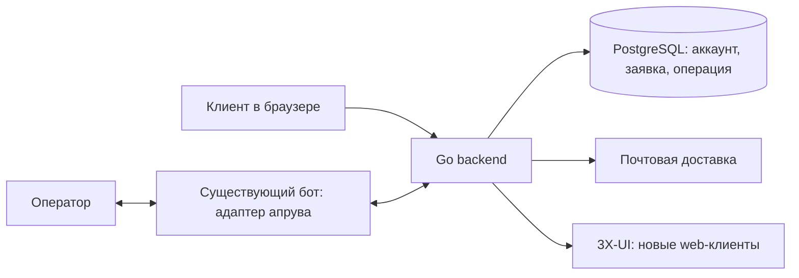

# С01: первый web-триал с апрувом в боте

Дата: 2026-10-01. Статус: спецификация принята пользователем; подготовлен
[план реализации](../plans/2026-10-01-s01-web-trial.md).
Tasks1–7 локально реализованы; реальная приёмка ожидает тестовых ресурсов.
[Evidence](../../evidence/s01-acceptance.md). Исходная версия бота: `3xui-shop` 1.31.0,
`74c124906462f5b75a323aa9b80944dd08df2037`.

Основной порядок работ задаёт [роадмап](../../roadmaps/2026-10-01-platform-roadmap.md).
Этот документ определяет С01; [общий архитектурный черновик](2026-10-01-cabinet-backend-miniapp-design.md)
используется как контекст. Продуктовые и технические решения ниже приняты
пользователем, включая новые web-аккаунты, UUID и личные карточки операторов.
Production, секреты, действующая почта и версия рабочей панели не исследовались.

Название продукта не используется в именах модулей, команд, cookie, API и документов. Публичный HTTPS-origin кабинета задаётся настройкой `CABINET_ORIGIN`, а не фиксируется в коде.

## 1. Результат и граница

Новый клиент без Telegram регистрируется в web-кабинете (`CABINET_ORIGIN`), подтверждает
email и просит триал. Оператор принимает решение в существующем боте. Backend
записывает решение, создаёт доступ в 3X-UI и показывает рабочую ссылку в кабинете.

С01 включает регистрацию, минимальный вход/выход, заявку и её состояние,
операторскую карточку с кнопками, устойчивую выдачу, ссылку подключения и аудит.
Запрос триала — структурированная заявка, а не полноценный чат поддержки.
Отдельная ссылка на контакт поддержки доступна и после отказа.

React-admin и независимый web-вход оператора появляются в Р2. Полная переписка,
вложения, восстановление/смена пароля, полный профиль и инструкции всех платформ
расширяются в С02–С06. Покупки, Mini App, привязка Telegram, промокоды и рефералы
не входят в С01. Регистрация свободна; апрув не ограничивает будущую покупку.

Первый результат проверяется на тестовой среде. Готовность С01 не означает
готовность публичного выпуска всего кабинета или разрешение на production.

## 2. Согласованные правила и текущий код

| Правило | Основание и применение |
| --- | --- |
| Email и пароль; подтверждение email | Решение пользователя; Telegram ID клиента не требуется и не подставляется искусственно |
| Триал по запросу; решение в боте | Решение пользователя; карточка approve/reject, запись и исполнение в backend |
| Отказ окончателен для заявки | Решение пользователя; клиент сам повторно не подаёт, пересмотр начинает поддержка |
| Один триал на аккаунт | Учет использования и защита от повторной выдачи; email не доказывает уникальность физического человека, оператор решает вопросы повторных регистраций |
| Параметры обычного триала | [SubscriptionService](../../../app/bot/services/subscription.py): `TRIAL_ENABLED`, `TRIAL_PERIOD`, `TRIAL_TRAFFIC_GB`, `BONUS_DEVICES_COUNT`; значения production неизвестны |
| Regular-доступ, постоянные ключи | [VPNService](../../../app/bot/services/vpn.py), [группы](../../../app/bot/services/inbound_groups.py): regular по тегам, отдельные UUID/subId; пустой набор инбаундов не считается успехом |
| Панель хранит трафик в байтах | [XuiClientsApi](../../../app/bot/services/xui_clients.py): `totalGB` — байты; положительный лимит устройств N передаётся как `limitIp=N+1`, в кабинете показывается N; нулевые лимиты сохраняют текущую семантику unlimited |
| Текущий апрув — регистрационный | [ApprovalService](../../../app/bot/services/approval.py), [handler](../../../app/bot/routers/admin_tools/approval_handler.py): lookup по tg_id, изменение допуска и отмена Stars при reject; эти эффекты не применяются к web-триалу |
| Окно обслуживания допустимо | Решение пользователя; у конкретного аккаунта/операции один исполнитель, автоматический fallback после таймаута запрещён |

Из старого апрува переиспользуются способ доставки и вид карточки, кнопки и
проверка оператора. Новый тип callback имеет отдельный префикс. Старые заявки
на регистрацию сохраняют свой смысл и не превращаются в заявки на триал.

## 3. Владение и первый этап переноса

Согласованная граница С01 — только новые web-аккаунты. PostgreSQL — единственный
источник их состояния; SQLite нынешнего бота остаётся источником старых
Telegram-аккаунтов. Никакой записи web-аккаунта в SQLite и синхронизации двух
копий его подписки. Привязка/импорт существующего клиента выполняются позднее.

В новом backend `account_id` — UUID, независимый от числового `users.id` старой
БД. При будущем импорте сохраняются `legacy_user_id` и `tg_id`, создаётся
однозначное соответствие с UUID. Это уточняет предварительный вариант числового
account_id в архитектурном черновике и исключает столкновение ID двух работающих
БД. Исторические ID не переписываются и не переинтерпретируются в аудите.

При завершении регистрации резервируются случайные постоянные `vpn_id` (UUID),
`sub_id` (16 символов `[0-9a-z]`) и `panel_key` (`acct_` + 32 hex-символа UUID).
Они независимы от email и Telegram. Панельный клиент до апрува не создаётся.
Если имя не задано, отображаемое имя — «Клиент»; почта не попадает в комментарий
панели. `panel_key`, `vpn_id`, `sub_id` и назначение сервера при повторах сохраняются.

Для С01 настроена одна тестовая панель, без автоперераспределения по пулу. Её
версия должна поддерживать используемый client-centric API и выбранные ключи.
Она выделяется для новых web-клиентов и не обслуживается legacy-задачами бота.
Адрес подписки и доступ к панели задаёт оператор инфраструктуры, интерфейс
управления серверами здесь не требуется. Полный пул переносится в С38/С39.

Перед production-передачей этой группы нужны выделенная панель либо проверенная
изоляция владельцев на общей панели: старые sync/reset/delete/bulk-операции не
меняют backend-клиентов. Если это не доказано, группа не включается на общей
панели. Совместное использование её ёмкости тоже требует согласованного учёта;
само различие ключей не решает этот вопрос.

Backend: Go + Echo, pgx/sqlc и River; HTTP и исполнители могут работать в одном
процессе. Bot token хранится только у бота. У адаптера нет доступа к PostgreSQL
и панели этой группы; он принимает задания и отправляет решения через API.
Существующие Python-сервисы используются как источник проверяемых правил.

## 4. Путь клиента

1. Клиент вводит email и принимает опубликованные версии условий/политики.
   Создаётся одноразовая проверка адреса, не аккаунт с чужим заранее заданным паролем.
2. Письмо открывает экран подтверждения; владелец задаёт пароль и явно завершает
   регистрацию. Автоматический просмотр ссылки почтовым сканером не подтверждает
   адрес. Повтор регистрации не меняет существующий пароль.
3. Клиент входит по email/паролю. В кабинете видны «Доступ ещё не выдан» и
   «Запросить пробный доступ», если триал включён и нет использованного/ожидающего.
4. Запрос с необязательным комментарием до 1000 символов сохраняется в backend.
   Повтор нажатия/сетевого запроса возвращает ту же заявку. Клиент видит
   «Заявка отправлена. Ожидаем решения поддержки» и время создания.
5. После approve: «Пробный доступ одобрен. Подключение готовится». После reject:
   «Пробный доступ не одобрен» и контакт поддержки; новой клиентской кнопки нет.
6. После проверенной выдачи показываются срок, устройства, лимит трафика,
   ссылка и «Скопировать». Есть краткая инструкция ручного импорта; реальное
   подключение проверяется на одном поддерживаемом текущим продуктом VPN-клиенте.
7. При сбое панели показано «Подключение требует проверки поддержки», без её
   технической ошибки. При истечении срока доступ отображается как истёкший.

Кабинет обновляет ожидающий статус опросом API каждые 5 секунд; после конечного
результата опрос прекращается. SSE/WebSocket не требуются. При запросе
ссылки сервер проверяет владельца, выдаёт `Cache-Control: no-store`; ссылка не
попадает в аналитику, логи, письмо подтверждения или карточку оператора.
Все формы доступны с клавиатуры, имеют подписи, видимый focus и понятные ошибки.
Текущие ru/en сохраняются. Пустые, загрузочные и ошибочные состояния предусмотрены.

## 5. Решение оператора

В С01 используется существующая доставка основным ботом в личные чаты
разрешённых администраторов. Персональный Telegram topic web-клиенту не создаётся.
Форумный support-прокси и переписка остаются С37/С05.

Карточка содержит номер заявки, подтверждённый email, комментарий, время и
состояние. Пользовательский текст экранируется. Ключ VPN, пароль, код email и
сервисные секреты не включаются. Approve/reject используют `request_id`, а не
Telegram ID клиента. Пример callback: `wt1:a:<request_uuid>` / `wt1:r:<request_uuid>`.
Он укладывается в [лимит Telegram 1–64 байта](https://core.telegram.org/bots/api#inlinekeyboardbutton).

Адаптер получает реальный `callback.from_user.id`, проверяет его текущие права
и передаёт `operator_tg_id` в закрытый API. Backend повторно проверяет разрешённый
ID и права сервисного адаптера. ID из произвольного клиентского body не является
доказательством оператора. Несогласованные allowlist запрещают решение; анонимные
сообщения/отсутствующий человек не заменяются ID группы или самого бота.

Первое допустимое решение фиксируется атомарно с actor/time/reason. Одновременные
approve/reject двух операторов дают один результат; проигравший видит текущее
состояние. Повтор того же решения возвращает его, противоположное — конфликт.
Approve создаёт одну операцию выдачи, reject не меняет аккаунт/VPN/Stars.
Для reject достаточно причины `support_declined`; дополнительные комментарии
оператора хранятся в аудите, не раскрываются клиенту автоматически.

После отказа поддержка может начать пересмотр кнопкой «Пересмотреть» в карточке:
подтвердить действие и указать причину 1–1000 символов. Backend создаёт новую
pending-заявку с `previous_request_id`; старая остаётся rejected. Клиент не
получает возможности создавать её сам. Новый approve допустим только если триал
ещё не использован/зарезервирован и нет другой активной заявки.

Сбой обновления сообщения не откатывает решение. Если карточка доставлена, а
подтверждение доставки потеряно, возможно повторное сообщение; его кнопки не
создают вторую выдачу. При отключённом боте заявки сохраняются. После фиксации
approve в backend отключение Telegram не останавливает очередь выдачи.

## 6. Данные и состояния

| Сущность | Минимальные данные и ограничения |
| --- | --- |
| Account | UUID; уникальный email_key, исходный email, password_hash, email_verified_at, locale, accepted policy versions/time, restricted, vpn_id/sub_id/panel_key; nullable tg_id и legacy_user_id для будущего импорта |
| RegistrationChallenge | UUID, email_key/адрес, locale/версии, hash токена/кода, сроки/попытки/used_at; пароля аккаунта здесь нет |
| Session | hash случайного ID, account_id, created_at/last_seen/expires_at/revoked_at; клиентская cookie, отдельный CSRF token |
| TrialRequest | UUID, account_id, previous_request_id/null, comment, pending/approved/rejected, created_at, decided_at/actor/reason; не более одной активной заявки аккаунта |
| TrialGrant | unique account_id, unique request_id/operation_id, reserved/granted, снимок конфигурации; резервация блокирует второй триал даже при неизвестном результате панели |
| Operation | UUID, queued/running/needs_review/applied, выбранная панель, постоянные ключи, неизменяемые цели выдачи, попытки/lease/ошибка; одна операция на TrialGrant |
| Delivery | UUID, request_id, allowlisted chat, typed payload, pending/leased/delivered, hash lease token/срок, message_id/null; повтор отправки безопасен для доменного решения |
| Audit | actor source + реальный operator_tg_id, target account/request/operation, action/reason/time/result; старые Telegram ID не трактуются как UUID |

Переход заявки: `pending → approved` или `pending → rejected`; обе ветки
окончательны. Пересмотр создаёт новую заявку. Ограничение активной заявки
дополняется уникальной резервацией TrialGrant, а не только состоянием UI.

Создание заявки и approve требуют подтверждённого, не restricted аккаунта,
включённого триала, отсутствия TrialGrant и прежней подписки/назначения сервера.
Клиентская кнопка не заменяет серверную проверку. Изменение TRIAL_ENABLED или
параметров после принятого approve не переписывает его снимок; изменение
ограничений аккаунта до исполнения переводит операцию на проверку поддержки.

Approve выполняется в одной PostgreSQL-транзакции: блокировка аккаунта/заявки,
повторная проверка доступности, снимок параметров, запись решения и TrialGrant,
Operation и постановка задания через River. При rollback ни решения, ни выдачи.
[Транзакционная постановка River](https://riverqueue.com/docs/transactional-enqueueing)
согласует DB и задание; она не делает HTTP-операцию панели атомарной с DB.

Задание выдачи устанавливает постоянные цели непосредственно перед первым
изменением панели: сервер, UUID/subId/key, regular-инбаунды, devices, bytes,
expiryTime = время первого начала выдачи + TRIAL_PERIOD дней. Повтор не двигает
срок и не меняет конфигурационный снимок. Не выбирать другой сервер после
неопределённого ответа прежнего.

## 7. Выдача и восстановление

1. Проверить готовность панели, regular-инбаунды и допустимые параметры;
   TRIAL_PERIOD > 0, devices >= 0, traffic_gb >= 0, преобразование без overflow.
   Одновременные записи одной операции сериализованы; просроченная аренда
   исполнителя требует сверки перед продолжением.
2. Прочитать клиента по сохранённому panel_key. Если найден, проверить совпадение
   UUID/subId и принадлежность операции. Чужая/неоднозначная запись — needs_review.
3. При достоверном отсутствии создать клиента с теми же сохранёнными целями.
   Набор инбаундов соответствует regular; неизвестные группы не изменяются.
4. После ответа прочитать фактические ключи, срок, устройства, лимит и членства.
   Только подтверждённое совпадение даёт `Operation.applied` и `TrialGrant.granted`.
   Сам `HTTP 200`/сообщение бота этого не доказывает.
5. При частичной выдаче завершать ту же операцию и недостающие членства; не
   запускать продление, resetTraffic, новую подписку или новый UUID. Не затирать
   пароли протоколов/неизвестные поля панели неполным update payload.

До внешней записи сетевые сбои могут повторяться с ограниченным backoff.
Стартовый предел — 5 попыток; задержки 10/30/120/300 секунд. После таймаута
записи сначала выполняются чтение/сверка. При неподтверждённом результате —
needs_review, резервация сохраняется. Нельзя снять «триал занят» только потому,
что HTTP-вызов вернул ошибку, и нельзя удалять аккаунт как компенсацию.

Для needs_review оператор получает карточку с кнопкой «Проверить выдачу»;
она ставит чтение/сверку той же Operation. Повтор create возможен только после
достоверного отсутствия и проверки защиты панели от дубля panel_key/UUID.
Если эти гарантии отсутствуют, автоматическое продолжение запрещено и оператор
инфраструктуры проверяет панель. Эта процедура входит в тестовую готовность;
произвольный редактор панели или принудительная новая выдача через API не вводятся.

Недоступность email после регистрации, остановка бота и ошибка доставки
операторского результата не отменяют уже выданный доступ. Ключ показывается
владельцу в кабинете. Фактический расход читается из панели с observed_at;
при ошибке чтения старые данные явно помечены, успех не выдумывается.

## 8. Минимальный API С01

Авторский контракт пока находится в этой спецификации; действующего OpenAPI,
генератора клиентов и потребителей нового API в репозитории не обнаружено.
Подготовленный план задаёт его перенос в единый OpenAPI перед реализацией API;
этот OpenAPI становится источником реализаций. Здесь нет нового runtime API или
генерированных файлов. Форматы других сценариев не утверждаются этим документом.

UUID передаются строками, времена — ISO 8601 UTC, байты — integer >= 0.
Неизвестные поля/параметры отвергаются. Нет произвольных URL панели или model fields.
Изменения клиента требуют session+CSRF+Origin; auth POST без сессии проверяют
Origin. Internal недоступен браузеру, использует HTTPS и отдельный сервисный
credential со scope адаптера; каждый операторский вызов проверяет actor allowlist.

| Метод и полный путь | operationId | Вход → результат |
| --- | --- | --- |
| POST `/api/v1/auth/register` | registerAccount | email, locale ru/en, accepted_terms_version, accepted_privacy_version → 202 `{challenge_id,resend_after}`; ответ одинаков для существующего адреса |
| POST `/api/v1/auth/verify-email` | verifyEmail | token либо challenge_id+code, new_password → 200 `{verified:true}`; аккаунт создан один раз, сессия не создаётся |
| POST `/api/v1/auth/resend-verification` | resendVerification | email → 202 `{resend_after}`; одинаковый внешний ответ |
| POST `/api/v1/auth/login` | loginAccount | email,password → 200 `{account,csrf_token}` и новая cookie; неверные данные → 401 без уточнения существования email |
| POST `/api/v1/auth/logout` | logoutAccount | без body → 204; отзыв текущей сессии, повторный logout безопасен |
| GET `/api/v1/me` | getAccount | session → 200 `{account,csrf_token,capabilities}`; account: account_id UUID, email, email_verified, locale, telegram_linked=false |
| POST `/api/v1/trial-requests` | createTrialRequest | `{comment?}` + Idempotency-Key UUID → 201 TrialRequest; повтор той же заявки → 200; использован/зарезервирован/отказан → 409 |
| GET `/api/v1/trial-requests/current` | getCurrentTrialRequest | session → 200 `{request:TrialRequest|null}`; только владелец |
| GET `/api/v1/subscription` | getSubscription | session → 200 Subscription; status none/provisioning/needs_review/active/expired, expires_at/null, devices, traffic_limit_bytes, traffic_used_bytes/null, observed_at/null, data_stale |
| GET `/api/v1/subscription/key` | getSubscriptionKey | session → 200 `{subscription_url}` для подтверждённой выдачи; недоступен → 409; no-store |
| POST `/internal/v1/telegram/jobs/claim` | claimTelegramJobs | service auth, `{limit:1}` → 200 `{jobs:[{job_id,lease_token,lease_expires_at,chat_id,kind,payload}]}`; не более одного задания С01 |
| POST `/internal/v1/telegram/jobs/{id}/result` | completeTelegramJob | service auth, `{lease_token,result}`; typed sent(chat_id,message_id) или delivery_failed(code) → 200; чужая/просроченная аренда → 409 |
| POST `/internal/v1/trial-requests/{id}/decision` | decideTrialRequest | service auth, `{operator_tg_id,decision:approve|reject,callback_query_id,reason?}` → 200 `{request,operation_id:null|UUID}`; повтор безопасен, противоположное решение → 409 |
| POST `/internal/v1/trial-requests/{id}/reconsider` | reconsiderTrialRequest | service auth, `{operator_tg_id,reason}` + Idempotency-Key → 201 новая TrialRequest с previous_request_id; только rejected и допустимый аккаунт |
| POST `/internal/v1/trial-operations/{id}/reconcile` | reconcileTrialOperation | service auth, `{operator_tg_id,reason}` + Idempotency-Key → 202 `{operation_id,status}`; та же операция, не новый триал |

TrialRequest в ответе: `request_id`, `status`, `created_at`, `decided_at|null`,
`operation_id|null`; клиент не получает actor/внутренний reason/чужие данные.
Внутренний ответ дополнительно содержит состояние доставки и данные карточки
этой заявки. Claims имеют аренду 60 секунд; один worker забирает одну карточку,
отправка имеет HTTP-timeout 10 секунд. Результат сверяется с разрешённым chat_id.
При утрате ответа возможен
повтор отправки. Отдельный секрет бота не даёт доступа к пользовательской ссылке.

Idempotency-Key привязан к principal+operationId+body: повтор возвращает исходный
результат, другой body → 409. Для активной заявки/выдачи действуют DB-ограничения
независимо от TTL ключа. Decision дополнительно дедуплицируется callback_query_id.
При успешном commit и потерянном ответе кнопка читает уже принятое решение.

Ошибки: `{error:{code,message,request_id}}`, без SQL/stack trace/секретов.
Внутренний 409 решения для проверенного оператора дополнительно содержит
`current_request_status` и `operation_id|null`, чтобы показать победившее решение
без обращения бота к DB. Публичные ошибки этих данных не раскрывают.
400 — структура/валидация; 401 — отсутствие/ошибка аутентификации; 403 — нет прав;
404 — отсутствующий или чужой ресурс; 409 — состояние/идемпотентность;
429 + Retry-After — лимит; 503 — временная недоступность необходимого сервиса.
Коды: `INVALID_INPUT`, `INVALID_CREDENTIALS`, `EMAIL_VERIFICATION_REQUIRED`,
`ACCOUNT_RESTRICTED`, `TRIAL_DISABLED`, `TRIAL_ALREADY_USED`,
`TRIAL_RECONSIDERATION_REQUIRED`, `REQUEST_STATE_CONFLICT`, `OPERATION_NOT_READY`,
`IDEMPOTENCY_CONFLICT`, `RATE_LIMITED`, `SERVICE_UNAVAILABLE`.

## 9. Регистрация и защита

Параметры ниже — принятые настройки С01, не наблюдение production.
Email_key: trim, регистр не учитывается, домен нормализуется; точки и +suffix
не удаляются. Подтверждение и уникальность проверяются в одной DB-транзакции.
Challenge привязан к цели регистрации; токен 256 случайных бит, 24 часа,
хранится hash. Код 8 цифр, 10 минут, максимум 5 попыток. Пересылка отзывает
старые секреты; почтовый worker не отправляет уже отозванный challenge.
Пароль задаётся только при завершении владельцем адреса. Для существующего
email регистрация возвращает такой же 202, но не создаёт новый аккаунт и не
выдаёт challenge смены пароля; письмо владельцу предлагает обычный вход.

Ссылка подтверждения передаёт токен через fragment; frontend убирает его из
URL до других обращений и отправляет POST после действия пользователя.
Письма ставятся в River вместе с challenge; секретный payload шифруется готовым
authenticated-encryption API, ключ вне DB/backup; после доставки payload удаляется.
Ни пароль, ни открытые email/session/lease токены не попадают в логи/аудит.

Пароль 15–128 символов, Unicode/пробелы/вставка разрешены; без тихого усечения
и требований сочетать регистры. Проверка локального списка распространённых
паролей. Argon2id с солью, минимум 19 MiB/2 прохода/parallelism 1; стоимость
измеряется на целевом сервере, число одновременных хеширований ограничено.
Основания: [OWASP Authentication](https://cheatsheetseries.owasp.org/cheatsheets/Authentication_Cheat_Sheet.html),
[OWASP Password Storage](https://cheatsheetseries.owasp.org/cheatsheets/Password_Storage_Cheat_Sheet.html).

Cookie `__Host-session`: Secure, HttpOnly, SameSite=Lax, Path=/,
без Domain; 7 дней простоя/30 дней абсолютного срока, новый ID при входе.
В DB hash ID; идентификатор не хранится в localStorage. CSRF и точная allowlist
Origin для изменений; пользовательский текст всегда экранируется.

Письма: не чаще 1/мин и 5/час на адрес; login: 5 неуспехов/15 мин на email_key
и 30/15 мин на IP. Лимит по IP не доказывает повторного клиента. Redis используется
для ограничителей, PostgreSQL — для основной истины. При потере ограничителя
login/отправка писем временно дают 503; текущая сессия/выдача продолжаются.
Не обещать доставленное письмо по одному принятию API; показывать кнопку повторной
отправки и понятный общий сбой без раскрытия существования чужого аккаунта.

## 10. Проверяемая приёмка

| № | Проверка | Условие успеха |
| --- | --- | --- |
| 1 | Новый клиент без Telegram проходит весь путь | Подтверждённый аккаунт, заявка, реальный апрув в боте, одна выдача и работающее VPN-подключение; нет искусственного tg_id |
| 2 | Бот выключен до решения | Регистрация/login/заявка доступны; заявка сохранена, операторская доставка возобновляется после запуска |
| 3 | Бот выключен после commit approve | Выдача и ссылка в кабинете завершаются самостоятельно |
| 4 | Повторная регистрация, чужой адрес, почтовый сканер, два подтверждения | Нет заранее навязанного пароля, GET не подтверждает адрес, уникальный аккаунт и одно потребление challenge |
| 5 | Неверный/просроченный/повторный токен или код, brute force | Нет входа/изменения владельца; проверенные лимиты и безопасные ошибки |
| 6 | Client-origin подменён, CSRF отсутствует, чужой request/key | Отказ до изменения/раскрытия данных; VPN-ссылка не кешируется и не логируется |
| 7 | Повтор POST заявки и другая Idempotency-Key | Одна активная заявка, тот же клиентский результат; другой body с тем же ключом даёт конфликт |
| 8 | Оператор не разрешён, anonymous sender, body с подставным TG ID, старый approval callback | Нет решения по web-триалу; допуск проверяет backend, старый callback не меняет новый тип заявки |
| 9 | Два оператора одновременно approve/reject; повтор после таймаута | Один результат, одна Operation/TrialGrant и непротиворечивый аудит |
| 10 | Reject и самостоятельная повторная подача | Нет доступа/новой заявки; аккаунт доступен; нет изменения Stars/покупки; контакт поддержки показан |
| 11 | Пересмотр поддержкой и старые кнопки | Причина записана, новая заявка связана со старой; старые решения не переписываются, использованный триал не выдаётся снова |
| 12 | Панель недоступна/нет regular-инбаундов/невалидная конфигурация | Нет ложного успеха и нового ключа; управляемый повтор либо needs_review |
| 13 | Панель выполнила add, HTTP-ответ потерян; worker/DB перезапущены | Сверка находит исходные UUID/subId/key, завершает ту же операцию; срок не продлён и трафик не сброшен |
| 14 | Частичные членства или конфликт ключа | Восстановление только своей операции, чужой клиент не изменён; нет автоматического переноса на другой сервер |
| 15 | Настройки триала изменились после approve | Исполняется записанный снимок; панель хранит байты и N+1, кабинет показывает N |
| 16 | Доставка карточки/результата повторилась или edit_message не удался | Решение и доступ не отменены и не дублированы |
| 17 | Backend доступен только к своей тестовой панели | Данные/ключи legacy-клиентов и их обработчики не меняются; неизвестные группы не затрагиваются |
| 18 | Logout, истечение сессии, keyboard/ru/en, loading/error | Сессия отозвана; формы и состояния работают на узком/широком экране |
| 19 | Backup PostgreSQL и восстановление после остановки | Аккаунт/заявка/резервация/операция сохранены, очередь сверяет панель и не создаёт второй доступ |

Тесты правил/конкуренции и HTTP-контракта дополняются браузерной проверкой и
реальной тестовой панелью. Mock add не доказывает рабочую подписку или поведение
после потерянного ответа. Численные лимиты проверяются тестовыми часами, не
ожиданием реальных суток. Для проверки истечения используется тестовый срок.

## 11. Готовность среды и передача

Для тестовой приёмки владелец предоставляет SMTP/отправителя, isolated 3X-UI
с regular-тегами и URL подписки, тестового оператора/бота, PostgreSQL/Redis,
HTTPS-origin, версии опубликованных условий/политики и контакт поддержки.
Значения секретов передаются штатным защищённым механизмом, не в документ.
Backend получает только DB/SMTP/panel/service secrets; bot token ему не нужен.
Получение этих ресурсов не является разрешением использовать production.

При включении готовой группы в окне обслуживания: остановить относящиеся к ней
писатели/задания, сверить владельца и незавершённые операции, включить адаптер
и backend, проверить реальный путь, возобновить обслуживание. Не останавливать
3X-UI/Xray и не перевыдавать ключи. Нет второго обработчика той же заявки.
Первое создание web-аккаунтов не требует импорта всей legacy-БД.

Откат после новых записей сохраняет PostgreSQL и Operation, закрывает новые
заявки/решения и позволяет сверить уже принятую выдачу; новые web-аккаунты не
передаются старому боту через поддельные tg_id. Восстановление старого snapshot
поверх новых записей не считается безопасным откатом. Полное отключение старой
логики и импорт остальных сущностей остаются С46/С47 и итоговой Р8.

Alignment: [роадмап](../../roadmaps/2026-10-01-platform-roadmap.md) и
решения пользователя — **confirmed** для продуктовой границы; исходники раздела
2 — **confirmed** для указанного revision. Регистрационный апрув — **conflict,
consciously replaced** отдельным решением по триалу. UUID/account mapping и
разделение новых/старых аккаунтов — **confirmed** решением пользователя,
уточняющим архитектурный черновик. Runtime-конфигурация/ресурсы — **unverified**.

Подготовлен [план только С01](../plans/2026-10-01-s01-web-trial.md):
модули/экраны, единый OpenAPI, адаптер бота, проверки и порядок интеграции.
План ожидает review и выбора способа исполнения. Согласование спецификации
не подтверждает реализацию или production-запуск.
