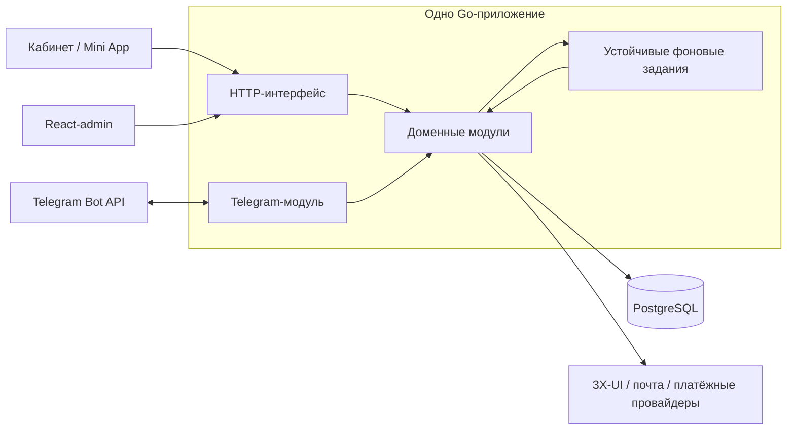

# Модульный Go-монолит с Telegram внутри приложения

Дата: 2026-10-05. Статус: спецификация принята владельцем ответом «Продолжаем»;
М01 проходит локальную приёмку; остальные переносы М02–М06 ещё не выполнены.

Основание — новое требование владельца: весь backend, включая функциональность
ботов, реализуется слабосвязанными модулями монолита; нынешний Python-бот в итоге
полностью удаляется. Эти требования приняты как направление пересмотра.
Границы модулей и направление перехода согласованы; подробные планы отдельных
переносов готовятся последовательно.
Владелец выбрал один Go-процесс для HTTP API, фоновых заданий и Telegram.

Документ уточняет [архитектурный контекст](2026-10-01-cabinet-backend-miniapp-design.md)
и [роадмап 48 сценариев](../../roadmaps/2026-10-01-platform-roadmap.md).
Он задаёт изменение архитектуры, сохраняя функциональный объём сценариев.
Первый ограниченный перенос описывает
[план М01](../plans/2026-10-05-m01-embedded-telegram.md).

## 1. Результат

Одна Go-программа содержит HTTP API, доменные модули, исполнителей River и
Telegram-модуль. Все части поставляются одной версией backend. Кабинет и
Mini App сохраняют общую React-кодовую базу, операторский интерфейс — React-admin.
PostgreSQL, Redis, почтовая доставка и 3X-UI остаются внешними зависимостями.

Telegram-модуль принимает обновления, обслуживает клиентского и support-бота,
формирует Telegram-ответы и доставляет сообщения. Бизнес-операции он вызывает
через публичные Go-интерфейсы соответствующих модулей внутри приложения.
HTTP API обслуживает внешних клиентов: кабинет, Mini App, React-admin и
платёжные уведомления. Канал Telegram и HTTP используют одинаковые правила.

Слабая связанность означает определённых владельцев данных и интерфейсов,
скрытые реализации и отсутствие произвольного доступа к чужим таблицам.
Разделение файлов на каталоги само по себе этого не обеспечивает.



Это схема исполнения. Конкретные зависимости пакетов определяются публичными
интерфейсами; стрелка обратного вызова не разрешает циклические Go-imports.

## 2. Модули и покрытие сценариев

Модуль — функциональная граница внутри приложения. Рекомендован один `go.mod`
и отдельные пакеты модулей: единая сборка и версия зависимостей. Отдельный
`go.mod` для каждой функции не является условием модульности.
Один Go-модуль может содержать несколько пакетов; серверную реализацию
рекомендуется держать в `internal`. Основание:
[официальный документ Go](https://go.dev/doc/modules/layout).

| Модуль | Владеет | Сценарии и взаимодействия |
| --- | --- | --- |
| `accounts` | Аккаунты, вход, email, пароли, сессии, роли, ограничения и привязка Telegram | С01, С02, С06, С31, С48 |
| `catalogue` | Тарифы, периоды, цены, доступность предложений и правила снимка покупки | С09 |
| `subscriptions` | Подписки, заявки на триал, решения оператора, сроки, тариф подписки и команды изменения доступа | С01, С03, С04, С06, С07, С08, С16, С17, С33; С10 использует исполнение купленного предложения |
| `payments` | Заказы, подтверждённые деньги, платежные провайдеры, возвраты, Stars-рекуррент и связь оплаты с исполнением | С10, С11, С12, С13, С14, С15, С18, С19, С20, С34, С35 |
| `vpn` | Пул серверов, 3X-UI, назначения, панельные операции, группы, сверка и месячный reset | С01, С03, С08, С19, С38, С39, С40, С41 |
| `support` | Обращения, вложения, состояние переписки, support-ban и соответствие Telegram topics | С05, С37; компенсация вызывается через `subscriptions` |
| `notifications` | Доставка, попытки, результаты, шаблоны, дедупликация и операторские рассылки | С27, С28; доставка email и Telegram через определённые интерфейсы |
| `telegram` | Telegram-протокол, приём обновлений, callback, `/start`, Mini App, Stars-транспорт и support relay | С30, С31, С32, С33, С34, С35, С36, С37 |
| `audit_reports` | Журнал действий, его просмотр/retention и отчёты по согласованным источникам данных | С26, С29 |
| `campaigns` | Рекламные ссылки, клики и кампанийная атрибуция | С25; показатели отчётов с С26 |
| `bonuses` | Промокоды, реферальные связи, награды и реферальная льгота триала | С21, С22, С23, С24 и реферальная ветка С33 |
| `operations` | Защищённые эксплуатационные процедуры, обслуживание, backup/restore, проверка конфигурации и перенос | С42, С43, С44, С45, С46, С47 |

Сценарий может затрагивать несколько модулей: это не несколько владельцев одной
операции. Например, `payments` подтверждает деньги, `subscriptions` принимает
команду исполнения, `vpn` владеет взаимодействием с панелью, а `telegram`
доставляет уведомление. У каждой записи и побочного действия один владелец.

С04/С30/С36 сохраняют клиентскую UI-часть в React. Backend-модули предоставляют
права, данные и операции этих сценариев; архитектурный пересмотр не переносит
React-интерфейс в Go.

Будущие модули появляются вместе с их сценариями. Кампании остаются в Р5,
промокоды и рефералы — в Р7. Пустые модули для ещё не реализованных функций
не создаются. Источник регистрации и старые идентификаторы учитываются с ранних
этапов, как требовал первоначальный роадмап.

## 3. Правила границ

1. Каждый модуль открывает небольшой набор типов и операций. HTTP- и
   Telegram-обработчики переводят внешние запросы в эти операции. Доменные
   интерфейсы не принимают Echo context, Telegram Update или HTTP wire-модели.
   Публичный контракт может быть экспортированными методами и типами пакета;
   отдельный Go `interface` для каждого сервиса не обязателен.
2. Реализация, SQL-запросы и репозитории принадлежат модулю. Потребитель
   использует его публичный интерфейс. Внутренние пакеты модуля можно разместить
   в его собственном `internal`, чтобы Go ограничивал их импорт.
3. Один PostgreSQL сохраняется. Таблицы и идентификаторы не переименовываются
   ради перемещения Go-файлов. История миграций остаётся согласованной;
   изменения схемы вводятся только для конкретного поведения.
4. Межмодульные изменения выполняются через операции владельцев. Отчётам
   доступны явно согласованные read-модели/представления; произвольная запись
   отчётного модуля в чужие таблицы запрещена.
5. Прямые вызовы подходят для проверки и принятия команд внутри процесса.
   River и сохраняемые задания используются для существующих устойчивых
   фоновых операций и доставки. Общая шина событий или plugin framework
   для связи каждого метода не вводятся.
6. Действительно необходимую атомарную операцию координирует конкретный сценарий.
   Подтверждение платежа и постановка задания исполнения остаются в одной
   PostgreSQL-транзакции. Сетевые вызовы выполняются вне SQL-транзакций;
   финансовая и панельная идемпотентность сохраняются.
7. Связывание зависимостей находится в точке сборки приложения. Общий
   `platform.Service`, способный выполнять любую доменную операцию, и общий
   доступ всех модулей ко всему `store` — переходная структура, не финальная.
   Для обратной зависимости потребитель объявляет узкий интерфейс нужной ему
   операции, а приложение подставляет реализацию. Например, `notifications`
   определяет контракт отправки; Telegram-клиент реализует его, а `app`
   связывает их. `notifications` не импортирует `telegram`, даже когда
   Telegram-обработчик вызывает уведомления. Аналогично Stars-транспорт
   связывается с `payments`, не создавая цикл импортов.
8. Конфигурация разделяется по владельцам. Наличие Telegram token обязательно
   для включённого Telegram-модуля, а запуск с отключённым модулем работает
   без него. Секреты остаются в файлах секретов, значения не попадают в логи.

Предлагаемая физическая структура:

```text
backend/
  go.mod
  cmd/server/             запуск приложения и существующие служебные команды
  internal/app/           сборка зависимостей и lifecycle
  internal/httpapi/       внешний HTTP-транспорт
  internal/modules/
    accounts/
    catalogue/
    subscriptions/
    payments/
    vpn/
    support/
    notifications/
    telegram/
    ...                   остальные модули при реализации их сценариев
  db/migrations/          согласованная история схемы
```

Дерево обозначает целевые границы, а не задание создать все каталоги сразу.

## 4. Telegram и работоспособность монолита

Telegram-модуль содержит интеграцию и маршрутизацию главного и support-бота.
Их токены и получатели задаются раздельно. Роли, суммы, eligibility триала,
возвраты, начисления и изменение подписки проверяют соответствующие доменные
модули; событие Telegram само по себе не даёт операторских прав.

Модуль использует локальные интерфейсы приложения. Для финального исполнения
бота не нужен собственный адрес backend, bearer token межсервисного API или
сетевой claim/result протокол. Сохраняемые задания и результаты доставки
остаются: смена транспорта не отменяет необходимость переживать рестарт,
обрабатывать повторы и согласовывать деньги с выдачей.

Ошибки и недоступность Telegram API обрабатываются с таймаутами и ограниченными
повторами в Telegram-модуле. Они не должны завершать HTTP-сервер и исполнителей
других операций. Readiness кабинета и состояние Telegram показываются отдельно.
Отключённый Telegram-модуль не останавливает web-поддержку, решения по триалу
в React-admin, внешние платежи или уже принятые задания выдачи.

У одного процесса общий предел ресурсов и общая судьба при аварийном завершении.
Логическая изоляция модуля не равна изоляции отдельного OS-процесса.
Выбранный однопроцессный вариант требует наблюдаемости и корректного завершения
каждого исполнителя. Отдельные постоянно запущенные API/worker/bot-процессы
в целевой поставке не используются. Разовые команды миграции или восстановления
не являются отдельными сервисами.

## 5. Переход с текущей реализации

Проверенные исходные факты на 2026-10-05:

- В новом backend один `platform.Service`, общий сгенерированный `store`,
  отдельный HTTP-слой; `cmd/server` запускает HTTP и River.
- Апрув С01 доставляет отдельный Python-адаптер. Он использует закрытый HTTP API
  backend с claim/result и решением по заявке; соответствующий Docker bot-сервис
  присутствует на стенде.
- С01–С09, С41 и С48 имеют локальную приёмку и включены в `v2` через PR #3.
- С10 имеет локальную приёмку; PR #5 в `v2` открыт, ревизия
  `afaeacf652964453ddd61883aa6da6a0d285783c`. Реальный перевод YooMoney и
  production-перенос не подтверждены.
- В GitHub 48 сценариев представлены 49 задачами; две ветки С33 разделены.

Первый ограниченный переход: точка сборки приложения,
правила импортов и новый Go Telegram-путь существующего С01. Сквозная проверка:
заявка web → карточка оператора → решение Telegram-модуля → устойчивая выдача
через модуль подписки/VPN. Проверяются также web-решение, повтор решения,
отказ и пересмотр поддержкой, отсутствие Telegram и рестарт.

Этот шаг использует уже работающие правила и тесты. Он не реализует заранее
полный Mini App, Stars, медиа-proxy или рефералов. После него существующие
части `platform`/`store` переносятся за границы модулей ограниченными задачами,
а новые сценарии сразу реализуются в своих владельцах. Новые способы оплаты
имеет смысл добавлять после определения границ `payments`/`subscriptions`/`vpn`.

Точное разбиение этих задач и способ включения открытого С10 определяются
планом перехода. Открытый PR не считается потерянной работой; его денежные
контракты, проверки и правила исполнения должны сохраниться.

При переносе старых production-операций прежний порядок остаётся обязательным:
готовая замена и восстановление → окно обслуживания → остановка прежних
писателей/обработчиков → перенос → включение нового владельца → проверка.
3X-UI/Xray и действующие ключи сохраняются. Одновременное исполнение одной
операции старым ботом и монолитом не допускается. Production-действия требуют
отдельной авторизации для соответствующего переключения.

## 6. Полное удаление нынешнего бота

Полное удаление — критерий финального С47, после покрытия всех сценариев и
сверки С46. Оно включает:

- Удаление Python-кода прежнего основного и support-бота, их бизнес-сервисов,
  DB/runtime-обвязки и переходного `deploy/acceptance/bot_adapter.py`.
- Удаление отдельного runtime bot-сервиса, его Docker-сборки, bot-only Python
  зависимостей и запускающих скриптов из целевой версии.
- Обновление CI и v2 release matrix: актуальный Go-образ содержит Telegram;
  отдельный образ старого Python-бота больше не собирается для новой версии.
- Удаление переходного bot-to-backend HTTP API и его секретов после перехода
  всех потребителей. Публичный API кабинета и webhook провайдеров сохраняются.
- Актуальные инструкции установки, backup/restore и эксплуатации описывают
  модульный монолит. Проверки прежнего поведения переносятся в проверки новой
  системы; они не удаляются только ради успешной сборки.

Постоянные ссылки, прежние Stars payload/charge, topics, ID, история денег и
аудит остаются поддержанными Go-кодом столько, сколько требует совместимость.
История Git, опубликованные старые версии и разрешённые снимки для миграции
не удаляются. Вспомогательные Python-проверки/экспорт данных, если нужны,
не считаются runtime старого бота и не должны импортировать удалённый `app`.

## 7. Затронутые решения, задачи и проверки

При принятии архитектуры согласованно обновляются следующие источники;
изменение документов не означает выполнение перечисленных изменений кода:

| Источник / задачи | Изменение |
| --- | --- |
| Общая архитектура, разделы 1/3/8/10/11/12/14 | Встроенный Telegram, локальные интерфейсы и общий lifecycle; переходный HTTP API обозначить временным |
| Роадмап: границы Р0, Р4, Р6, Р8; С32, С37, С44, С45, С46, С47 | Модульный Telegram, конфигурация/эксплуатация единого приложения, явное удаление Python-бота |
| Спецификация/план С01, стенд и Telegram-проверки | Перенос апрува из Python-адаптера в Go-модуль при сохранении поведения заявок |
| С10 и С11–С20; С34/С35 | Владельцы денег, исполнения и Stars-транспорта; сохранение транзакций, повторов и восстановления |
| С30/С31/С36 | Mini App и привязка используют те же аккаунты и публичные интерфейсы; продуктовые правила входа/перехода сохраняются |
| С27/С28/С29/С37 | Устойчивые доставка/аудит/поддержка и границы вызовов транспортных модулей |
| С38–С47, Compose, Docker и release workflow | Владельцы панельных операций, lifecycle, backup/restore и удаление legacy runtime/build |
| Остальные сценарии и GitHub-задачи | Указать модуль-владелец и действующий архитектурный документ; функциональный объём и поздний этап бонусов сохраняются |

Пройденные проверки остаются доказательствами поведения старой ревизии.
Новая структура импортов, внутренняя интеграция Telegram, lifecycle и состав
образа требуют новых проверок. Перемещение файлов без изменения правил не
аннулирует принятые требования, но не позволяет объявить новую ревизию
проверенной без regression и сквозного сценария.

## 8. Критерии архитектурной приёмки

1. У каждого сценария определён модуль-владелец; все 48 сценариев сохранены,
   включая позднюю реферальную ветку С33 и эксплуатационные эквиваленты.
2. Telegram работает внутри целевого Go-приложения и вызывает модульные
   интерфейсы. Он не выполняет доменные правила второй копией.
3. Границы импортов и доступа к данным проверяются в CI. Финальная сборка
   не использует общий всепредметный `platform.Service`/`store`.
4. Сохраняются публичные клиентские контракты, роли, денежная точность,
   идемпотентность, неизменяемые снимки покупки и идентификаторы VPN.
5. Подтверждение денег и задание исполнения атомарны; рестарты и повторы
   не теряют платёж и не выдают доступ второй раз.
6. Отключение/недоступность Telegram сохраняет HTTP-кабинет, web-поддержку,
   внешние платежи и фоновые доменные операции. Состояние канала наблюдаемо.
7. Финальная поставка и запуск обходятся без прежнего Python-бота, его
   bot-only зависимостей, образа и переходного отдельного адаптера.
8. С46/С47 проверяют перенос, поздние события, восстановление и согласованного
   владельца каждой операции до удаления старого исполнения.

## 9. Проверяемые исходники

- [Точка запуска](../../../backend/cmd/server/main.go),
  [общий сервис](../../../backend/internal/platform/service.go),
  [HTTP](../../../backend/internal/httpapi/api.go),
  [Telegram claim/result](../../../backend/internal/platform/telegram.go).
- [Python-адаптер С01](../../../deploy/acceptance/bot_adapter.py),
  [Compose стенда](../../../deploy/acceptance/compose.acceptance.yml),
  [v2 release workflow](../../../.github/workflows/v2-release.yml).
- [PR #3](https://github.com/ekho/3xui-shop/pull/3),
  [PR #5](https://github.com/ekho/3xui-shop/pull/5),
  [GitHub-план v2](https://github.com/users/ekho/projects/1/views/4).
